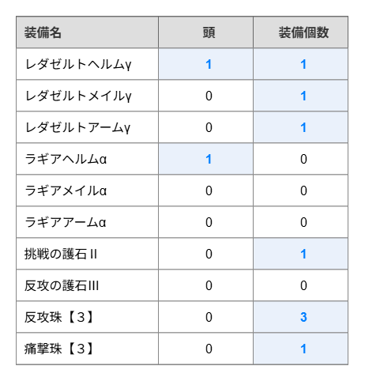
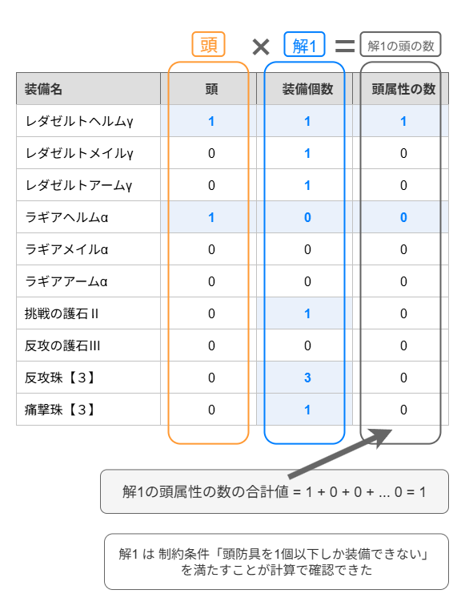
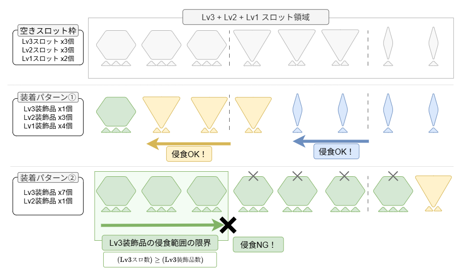

## ゼロから作る自動ダメージ最大化シミュレータ

この記事では自動ダメージ最大化シミュレータを作る方法をゼロから解説していきます。
まずは自動ダメージ最大化シミュレータの仕組みを解説し、次に具体的な実装例をハンズオン形式で実践していきます。

文章の構成としては、最適化シミュレーターの解説→実装という順序になっていますが、座学が嫌な人は実装編まで飛ばしても構いません。
そして実装してみて疑問が出てきたときに解説に戻ってくるという読み方でも問題ありません。

ダメージ最大化シミュレータをつくる人が界隈に増えてくれることを願ってこの記事を書きます。
個人的な事情としてだんだんとゲームに使える時間が減ってきておりいずれ失踪すると思っています。
失踪するまえに誰かにダメージ最大化シミュの自作文化を誰かに引き継いでほしいです。

具体例とポンチ絵を駆使してできるだけ詳しく、発想から説明するように心がけます。
これ読んで実装した読者が、サンプルコードをベースに別武器や次回作の最適化シミュを実装できるレベルを目指します。

## 自動ダメージ最大化シミュレータとはなにか？

自動ダメージ最大化シミュレータは、ゲーム中でダメージが最大になる構成を自動で見つけてくれるシミュレータです。

モンスターハンターというゲームには、さまざまな装備があり、装備の組み合わせが変わるとモンスターに与えるダメージが変化します。
この与ダメージが最大になる装備の組み合わせを自動で考えてくれるのが自動ダメージ最大化シミュレータです。
自動ダメージ最大化シミュレータでは長いので以降は ダメ最大化シミュ と表記します。

私は過去に2つの自動ダメージ最大化シミュレータを公開してきました。
Monster Hunter Wilds 版のダメ最大化シミュは Web サイトで公開しています。
ダメ最大化シミュの動作イメージを確認したい場合はサイトにアクセスして、右下の最適化ボタンを押してみてください。


## 自動ダメージ最大化シミュレータの仕組み

自動ダメージ最大化シミュレータの仕組みを一言で言うと、「最適化ソルバーに解かせよう！」というものになります。

世の中には最適化ソルバーという素晴らしいツールがあり、これがモンハンの最大ダメージ構成を考える上でのさまざまな難しい問題をまとめて解決してくれます。
最適化ソルバーの内部の仕組みは難しいですが、利用するだけであればそれほど難しくはありません。
このドキュメントでは最適化ソルバーの性質と利用方法を見ていきます。

最適化ソルバーには以下のような嬉しい性質があります。

> 最適化ソルバーに対して「`装備の条件` と `ダメージ計算式`」を入力すると、「`ダメージが最大になる装備の組み合わせ`」が出力される

より一般的に言うと

> 最適化ソルバーに対して「制約条件 と 目的関数」を入力すると、「その制約条件の範囲内で、目的関数が最大 or 最小になるような組み合わせ」が出力される

モンハンの場合、「制約条件」が「装備の条件」に相当し、「目的関数」が「ダメージ計算式」に相当します。


ここで言う装備の条件とは、例えば「頭防具は1つしか装備できない」とか「装飾品はスロットが合うものしか装備できない」のような条件です。
ゲームをプレイする上で暗黙のうちに了解しているさまざまな装備の制約を入力する必要があります。
また、ここで言う「ダメージ計算式」とは例えば「攻撃力〇〇の弓を装備して△△モーションをモンスターに当てると✕✕のダメージになる」のようなダメージを決定する計算式のことです。

最適化ソルバーの嬉しい点は、最適化ソルバーの内部の詳細な仕組みを知る必要がないことです。
つまり、この記事で作っていく最適化シミュ は「難しい部分は最適化ソルバーに丸投げ！」というアプローチで、最大ダメージ装備を探すシミュレータということです。


ただし、最適化ソルバーは一定のフォーマットで入力しなければ最適化問題を解くことができません。
そのため、ダメ最大化シミュを実装するうえでのチャレンジは「装備の条件をどのようにして最適化ソルバーが解ける形式に落とし込むか？」という点になります。
「装備の条件」と「ダメージ計算式」を最適化ソルバーが理解できる形式で入力することができるようになれば、ダメ最大化シミュの完成です。

ダメージ計算式については、すでに計算式がわかっているのであれば最適化ソルバーに入力するのは難しくありません。計算式をそのまま記述するだけです。
(ダメージ計算式において難しいのは、いかにしてダメージ計算式を推測するか？という点です)

問題は、装備の条件をどのようにして最適化ソルバーが解ける形式に落とし込むか、です。以降ではこの方法を見ていきます。


## 装備の条件を数式に落とし込む

ここまでの説明で、モンハンの装備条件を最適化ソルバーが解ける形式に落とし込む必要があることを見てきました。
最適化ソルバーが解ける形式とは数式のことです。
つまり、装備条件を数式として表現することができれば良いことになります。

実際のゲームデータを利用すると複雑になってしまうため、最初はサンプルデータを用意して説明していきます。
(この記事の後半では、実際のゲームデータを利用して最適化シミュを実装していきます。)


```
武器A: 攻撃力 20
武器B: 攻撃力 10
ゲーム内の暗黙の条件: 武器は1つしか利用できない
ダメージ計算式: (ダメージ) = (武器の攻撃力)
```

非常にシンプルなサンプルデータを用意してみました。

ダメージ計算式は武器の攻撃力をそのまま参照するため、攻撃力が高い武器Aのほうが高い与ダメージを得ることができます。<br>
つまり、この場合の最大ダメージ構成は「武器Aを1つ装備する」になります。

ここまでシンプルであれば、もはや最適化ソルバーなどという大袈裟なものを持ち出すまでもなく、直感的に最も強い構成がわかると思います。
しかし、ここでは装備条件を制約式の落とし込む練習のため、あえてこの問題を最適化ソルバーが解ける形式で表現してみましょう。

重要な条件として、武器は1つしか利用できないという条件があるので、これを制約式として表現してみます。

まずダメージ計算式は以下のようになります。

```
(ダメージ) = (武器Aの攻撃力) * (武器Aを利用する) + (武器Bの攻撃力) * (武器Bを利用する)
```

これを数式っぽく表現すると以下のようになります。

```
dmg = A_attack * A_use + B_attack * B_use
```

A_attack は武器Aの攻撃力 20 であり、変化しません。<br>
B_attack は武器Bの攻撃力 10 であり、変化しません。<br>
つまりダメージ計算式は以下のように書けます。

```
dmg = 20 * A_use + 10 * B_use
```

A_use は武器Aを利用するかどうかを表す変数であり、0 または 1 のどちらかの値を取ります。<br>
B_use は武器Bを利用するかどうかを表す変数であり、0 または 1 のどちらかの値を取ります。

ここで、武器は1つしか利用できないという条件があるので、 A_use + B_use は2以上になることはありません。<br>
つまり、A_use + B_use は1以下という制約条件が必要になります。

```
A_use + B_use <= 1
```

最終的に、以下のような装備の制約条件と目的関数が導かれました。
あとは、こちらを最適化ソルバーに入力すると、最大化問題の解として (A_use, B_use) = (1, 0) の組み合わせが出力され、「武器Aを使用したほうが与ダメージが高い」ということがわかります。

```
制約条件:
A_use + B_use <= 1
0 <= A_use <= 1 (ただし A_use は整数)
0 <= B_use <= 1 (ただし B_use は整数)

目的関数:
20 * A_use + 10 * B_use
```

さてここまでの流れをみて、「直感的にわかることを冗長で複雑に書いてる」と感じたかもしれません。私もそう思います。<br>
しかし、このような条件を数式に落とし込む手順を発展させていくと、問題が複雑になり人力ではとても解けないような規模の問題になった場合でも最適化ソルバーを利用して問題を解けるようになります。
なので今しばらくお付き合いください。

さて、上記の問題については完成した「制約条件と目的関数」を最適化ソルバーに投げて終了なのですが、最適化ソルバーの性質について理解を深めるためもう少し深堀りしましょう。

次は、上記の制約条件と目的関数をグラフで表現してみましょう。

まず以下の制約条件をグラフ上に図示します。
横軸が A_use の値を表し、縦軸が B_use の値を表しており、制約式の範囲は図のような正方形の領域になります。

```
0 <= A_use <= 1 (ただし A_use は整数)
0 <= B_use <= 1 (ただし B_use は整数)
```


ここで、さらに以下の制約式を追加すると、制約式の範囲は図のような三角形の領域になります。

```
A_use + B_use <= 1
```


最後に目的関数 `20 * A_use + 10 * B_use` はグラフ上でどのように表現できるかを考えます。
まずは、 `20 * A_use + 10 * B_use = 30` になる点をリストアップしてみます。
(A_use, B_use ) = (0, 3), (1, 1), (2, -1) となります。
これを線でつなぐと、 `20 * A_use + 10 * B_use = 30` を満たす線を引くことができます。


次に `20 * A_use + 10 * B_use = 40` となる等高線を引くと以下のようになります。


ここで、 20 * A_use + 10 * B_use はダメージ計算式なので、大きければ大きいほどプレイヤーにとって嬉しいです。
なので、等高線をできるだけ右上にズラしていきたいです。
しかし、A_use と B_use には制約条件があり、グラフ上で図示された点しか取ることができません。
よって、A_use と B_use のグラフ上の点のうち、最も等高線が右上になる値の組み合わせ (A_use, B_use) = (1, 0) が、ダメージ計算式を最大化する値の組み合わせということになります。
また、`20 * A_use + 10 * B_use = 20` より最適解によって得られる最大ダメージは 20 であることも分かります。


つまり、ダメージ計算式の等高線を引き、等高線が高い方から低い方へ動かしていき、制約条件の表す範囲に重なる等高線まで動かして止めれば最大化問題が解けたことになります。

最適化ソルバーは、内部的にこのようなアプローチで最適化問題を解いています。<br>
実際にはもっと別の高度な仕組みで解いていますが、ダメ最大化シミュを実装するうえでは大雑把なアプローチを理解しておけば十分です。

## 装備の条件を数式に落とし込む 応用編

次は、問題設定をもう少しモンハンの装備条件に近づけてみましょう。

```
武器C: 攻撃力 30, 属性値 20
防具X: 攻撃強化Ⅱ, 属性強化Ⅰ, 体術 x2, 重量1kg
防具Y: 攻撃強化Ⅰ, 属性強化Ⅱ, 体術,    重量2kg

スキルの効果:
攻撃強化Ⅰ: 攻撃力を +10 (装備全体で「攻撃強化Ⅰ」がN個ついている場合、攻撃力の加算値は +10N とする。攻撃強化Ⅱ,属性強化Ⅰ,Ⅱについても同様)
攻撃強化Ⅱ: 攻撃力を +30
属性強化Ⅰ: 属性値を +20
属性強化Ⅱ: 属性値を +30
体術: ダメージ計算には寄与しない

装備の条件:
(条件1) 防具は0個以上のいくつでも装備できる
(条件2) 体術は最低5個欲しい
(条件3) 防具重量の合計の上限は4kg (4kg 以上の防具は重くて装備できない)

ダメージ計算式:
(ダメージ) = {(武器の攻撃力) + (攻撃強化スキルによる攻撃力加算)}
           + {(武器の属性値) + (属性強化スキルによる属性値加算)}
```

(モンハンには重量制限はなく装備を無限に装備することもできませんが、ここでは条件を式に落とし込む練習のために都合の良い条件を設定しています。)

さて、こうなると直感で解くのは難しくなってきたのではないでしょうか？<br>
それでは先ほどと同じように、上記の条件を制約式として表現し、グラフという簡易的な最適化ソルバーで解いてみましょう。

防具Xを装備する数を X_use, 防具Yを装備する数を Y_use とします。

まず (条件1) を考えます。<br>

> (条件1) 防具は0個以上のいくつでも装備できる

という制約条件を数式で表すと以下のようになります。

```
0 <= X_use (ただし X_use は整数)
0 <= Y_use (ただし Y_use は整数)
```

次に (条件2) を考えます。<br>
> (条件2) 体術は最低5個欲しい

防具Xには体術が2個付いているので、防具Xを X_use 個装備したときの体術の合計は 2 * X_use 個になります。
よって (条件2) を数式で表すと以下のようになります。

```
2 * X_use + 1 * Y_use => 5
```

同様に考えて、 (条件3)

> (条件3) 防具重量の合計の上限は4kg

を数式で表すと以下のようになります。

```
1 * X_use + 2 * Y_use <= 4
```

次に、以下のダメージ計算式を考えます。

```
ダメージ計算式:
(ダメージ) = {(武器の攻撃力) + (攻撃強化スキルによる攻撃力加算)}
           + {(武器の属性値) + (属性強化スキルによる属性値加算)}

スキルの効果:
攻撃強化Ⅰ: 攻撃力を +10
攻撃強化Ⅱ: 攻撃力を +30
属性強化Ⅰ: 属性値を +20
属性強化Ⅱ: 属性値を +30
```

各スキルの効果を考慮すると、ダメージ計算式は変数 X_use, Y_use を利用して以下のように書き直せます。

```
(ダメージ) = {(武器の攻撃力) + 10 * (攻撃強化Ⅰの個数) + 30 * (攻撃強化Ⅱの個数)}
           + {(武器の属性値) + 20 * (属性強化Ⅰの個数) + 30 * (属性強化Ⅱの個数)}
```

防具Xには攻撃強化Ⅱがついているので、X_use 個装備すると 30 * X_use の攻撃力が加算されます。
防具Yについても同様に考えるとダメージ計算式は以下のように表現できます。

```
dmg = {(30) + 10 * Y_use + 30 * X_use}
    + {(20) + 20 * X_use + 30 * Y_use}
    = 50 + 50 * X_use + 40 * Y_use
```

ここまでで制約条件と目的関数を変数 X_use, Y_use を利用して表現できました。
制約条件と目的関数をまとめると以下のようになりました。

```
制約条件:
0 <= X_use (ただし X_use は整数)
0 <= Y_use (ただし Y_use は整数)
2 * X_use + 1 * Y_use => 5
1 * X_use + 2 * Y_use <= 4

目的関数:
50 + 50 * X_use + 40 * Y_use
```

それでは次にグラフに図示し、最適解を求めてみましょう。

まず、制約条件をグラフに図示すると以下のようになります。<br>
青い三角形の領域が制約条件を満たす解の範囲です。
さらに、整数の制約も考慮すると解の候補は `(X_use, Y_use) = (2,1), (4,0)` のいずれかに絞れます。


次に先ほどと同様に目的関数の等高線を考慮すると、`50 + 50 * X_use + 40 * Y_use = 250` の場合に制約条件を満たし、かつ目的関数が最大となることがわかります。
よって、制約条件を満たす解のうち最大ダメージを実現する解は (4,0) であり、その最大ダメージは 250 であることがわかりました。


このセクションでは、問題を制約条件と目的関数に落とし込み、さらに作図により最適解を求めました。
後のセクションでは、この問題をプログラムとして表現し、最適化ソルバーに解かせるところまで実施します。

実際の最適化シミュを実装するうえでは、「作図により最適解を求める」部分は最適化ソルバーの仕事になるため、この部分は不要になります。
しかし、作図部分の動作原理は最適化シミュレータの最も簡単な動作を模倣したものなので、どのような問題であれば最適化ソルバーは高速で解くことができるのかについての示唆を得ることができます。

ここで登場した制約条件や目的関数は説明のために "簡単" な例を出しました。ここでいう簡単とはどういう意味かというと、制約条件や目的関数の中に「変数同士の掛け算がない」形式になっています。

変数同士の積がない or 少ないことは人間にとっても解きやすく、また最適化ソルバーにとっても高速に解けるものになります。
利用する最適化ソルバーによっては変数同士の積があると問題を解くことができません。

次のセクションではこの、最適化ソルバーが解ける問題や解きやすい問題の性質について見ていきます。

## どうやって式に落とし込めばよいか？

(書きかけ. 数学アレルギーがない人向け)

ここまでは具体例を出して説明してきましたが、そもそもダメージ最大化問題を解くというのはどのような取り組みでしょうか？
実際の問題に対応できるようにここで言語化しておきましょう。

最適化問題の立式を考える上でまず重要なのは「最適解とはなにか？」とを考えることです。
モンハンのダメージ最大化問題における最適解とは「ある条件のもとでダメージ計算式の結果が最も高くなる装備の組み合わせ」のことです。
例えばレダゼルトγシリーズ一式の装備が最高火力なのであれば、最適解とはレダゼルトγシリーズの一式装備になり、以下の組み合わせが最適解であると表現できます。

| 装備

次に考えることは「解の候補はなにか？」についてです。


まず、モンハンにおけるダメージ最大化を最適化問題として見たときの解の候補とはなんでしょうか？
それは、データ上存在するすべての装備をそれぞれ何個使うかを表現したベクトルです。
このベクトルが、制約条件を満たしており、かつそのベクトルを目的関数に適用したときのダメージの値が、他のどの解候補 (装備ベクトルの組み合わせ) よりも高い場合、そのベクトルはダメージ最大化問題における最適解である、と言えます。

前のセクションでは、問題における装備条件とダメージ計算式を、それぞれ制約条件と目的関数という形で、最適化ソルバーが解ける形式に落とし込んできました。
この定式化は以下のルールに従う必要があります。

1. 変数と定数からなる式によって制約条件を表現すること
2. 制約条件が最適解を持つこと

定式化の方針がわからない場合は以下のような問いを立ててください。

> (1) 最適解を求める上で不変の値はなにか？ (定数はなにか)<br>
> (2) 最適解を求める上で変化する値はなにか？ (変数はなにか)

例えば、先程の例で登場した「防具Dには体術Lv2がついている」という条件の場合、
「防具Bを何個装備するか？」は最大ダメージ構成を探すときに変化する値、すなわち変数です。ここでは変数 d_use と定義しました。

「防具Bに体術スキルLv2がついているというデータ」は最大ダメージ構成を探すうえで変化しない値、すなわち定数です。

結果として、変数 d_use, e_use を利用して以下のような制約条件式に落とし込むことができました。

```
5 <= 2 * d_use + 1 * e_use
```

## シミュを高速化するコツ

TODO:
ここにソルバーごとの解ける問題の種類、有償無償、性能を書きたい

最適化ソルバーの性質として「変数同士の掛け算が少ないほど問題を高速に解ける」という性質があります。<br>
例えば、変数 x と変数 y がある場合、

> - `xy` という式よりも、 `3x + 2y` のような式のほうが高速に解ける
> - `3x^2 + xy` という式よりも、 `3x + 3x + 2x + y` のような式のほうが高速に解ける

ということです。変数の数自体はどちらも同じですが、後者のほうが変数同士の掛け算が少なく、より高速に解くことができます。

変数同士の掛け算を減らした究極系、つまり変数同士の積がない式は一次式と呼ばれています。またこのような式の性質を線形性と呼ばれることがあります。
(厳密には線形性ではありませんが、工学などの応用系の分野では一次式を雑に「線形である」と呼ぶことがあります。)

つまり、もしあなたがモンハンのダメージ最大化問題をこの一次式の形に落とし込むことができたなら、より高速なシミュが作れるかもしれないということです！
(私は無理でした。問題の性質的に無理ではないかと思っています。)
ただし、変数同士の積を減らすために補助変数を導入すると、補助変数と制約式が増えるため必ずしも高速化するとは限らない点に注意が必要です。

とはいえ、立式する際の方向性として「変数同士の積を減らす」という意識を持っておくことは重要です。
実際のモンハンのデータを式に落とし込む際に、変数同士の掛け算を減らせないか？という視点を意識すると、より高速な最適化シミュを作れる可能性が上がります。

逆に、変数同士の掛け算が多すぎると計算が重くなってしまい、実用に耐えないほど遅いダメ最大化シミュになってしまう可能性が高くなります。


```note
実際の例として、サンブレイクの最適化シミュはワイルズの最適化シミュよりも最適解が見つかるのに時間がかかります。
サンブレイクもワイルズも仕組み的には同じ実装をしており、どちらも同じ最適化ソルバーを利用しています。
しかしサンブレイクのほうが攻撃力と属性値に対して乗算で効果があるスキルが多いため、変数同士の掛け算が多くなり結果として処理が重くなっています。
また防具のデータ数が多い点もサンブレイクのほうが処理が重い原因の1つです。
```


## 変数同士の掛け算ができてしまってもOK

線形計画法に慣れていると「最適化ソルバーは線形でない問題は解けない」という思い込みがあるかもしれません。
(私は以前は漠然とそう思っていました)

実際には、問題が線形になっていなくても (つまり、非線形であっても) 解けるソルバーはあります。
本ドキュメントの最適化シミュではSCIPというソルバーを利用します。
SCIPソルバーは無料で利用できる (Apache 2.0 License) ソルバーでありながら、MINLPという形式の問題を解くことができます。
MINLP (Mixed Integer Nonlinear Programming) は混合整数非線形計画問題のことで、制約条件式や目的関数が非線形であっても解くことができますし、変数に整数の制約が追加されても (つまり混合整数問題であっても) 解くことができるちおう優れものです。

つまり何が言いたいかというと「式に落とし込む際に変数同士の掛け算ができてしまっても、それを解けるソルバーはあるので諦めず実装してみましょう」ということです。<br>
（ただし、問題の規模によっては実用に耐えないほど遅くなる可能性があります）

こちらの詳細については数学的なトピックになります。
詳細を知らなくてもダメ最大化シミュは実装できるので、この記事では触れません。

興味のある方は以下のようなキーワードで調べてみてください。
- 1次式
- 線形計画問題
- 非線形計画問題
- 非線形混合整数計画問題


## 最適化シミュを自作する

ここまでの説明で、モンハンに模した装備条件やダメージ計算式を、最適化ソルバーが解ける形式に落とし込む方法を見てきました。
前のセクションではグラフを利用して解きましたが、次は実際にプログラムを書いて最適化ソルバーに解かせてみましょう。

最適化問題の設定としては、先程の制約条件と目的関数をそのまま利用します。

```
制約条件:
0 <= X_use (ただし X_use は整数)
0 <= Y_use (ただし Y_use は整数)
2 * X_use + 1 * Y_use => 5
1 * X_use + 2 * Y_use <= 4

目的関数:
50 + 50 * X_use + 40 * Y_use
```

ここから、制約条件と目的関数をプログラムで表現していきます。

最適解を得るまでの処理の流れは以下のようになります。


> 1. ゲームをベースに装備の制約条件を整理し、ダメージ計算式を推定します
> 2. Python プログラムにより制約条件とダメージ計算式を実装し、最適化問題のモデルに追加します
> 3. 最適化問題のモデルをファイルに出力します
> 4. モデルファイルを最適化ソルバーに入力し、最適解の出力を得ます

Python プログラムでは最適化問題をモデルとして定義します。
モデルに対して制約条件や目的関数、変数やパラメータなどを追加していくイメージです。
モデルを定義するためには Pyomo というモデリングツールのライブラリを利用します。

定義された最適化問題のモデルはファイルに出力することができます。ファイルの形式としては非線形問題を扱える AMPL NL形式 (Nonlinear) を利用します。
出力されたモデルファイルを最適化ソルバーに入力すると最適化を実行できます。
最適化ソルバーとしては SCIP を利用します。

Python, Pyomo, SCIP はいずれもそれぞれのライセンスのもと無料で利用できます。


まずは、プログラミングを実行する環境を構築しましょう。

このドキュメントはプログラミングをしたことがない人が、最適化シミュを自作できるようなドキュメントを目指して書いています。
なので、まずは環境構築というのがいかに大変かということを説明しておきます。

プログラミングにおける最大の難関は環境を構築することと言っても過言ではありません。
実際それくらい環境構築は大変です。
なぜ、環境構築が大変なのかというと、プログラミングでものを作る際には多くの外部ツールに依存して作ることになるからです。
実際に自分で作る部分が1%で残り99%は他のコードを流用するようなイメージです。
環境構築は99%の他のコードの依存関係を解決する仕事なので、大変になりがちです。

ということで、がんばって環境構築をしていきましょう。

環境は以下になります。

| 項目                                | 内容                       | 必須 |
|-------------------------------------|----------------------------| ---- |
| OS                                  | ubuntu 22.04.1 LTS         |      |
| 実行環境                            | Python 3.8.16              | ◯   |
| モデリングツールのライブラリ        | pyomo 6.4.4                | ◯   |
| Python version とライブラリ管理     | uv                         |      |
| 最適化ソルバー                      | SCIP version 8.0.3         | ◯   |

OS を ubuntu としているのは主に最適化ソルバー SCIP の実行環境のためです。<br>
SCIP はC/C++で実装されており、バイナリ形式のファイルを実行する形になるため、OSを揃えておいたほうがトラブルは少ないと思います。
一応 SCIP のパッケージとしては Linux/Windows/MacOS/Raspberry の環境のコンパイル済みパッケージが提供されているのでどの環境でも動かせると思いますが、この記事では試していません。<br>
(ソースコードからビルドする際には Linux を推奨します。昔 Windows 上でソースからビルドしましたがかなり大変でした。)<br>
Python はバージョンが揃っていればどのOSでも問題なく動くと思います。

この記事では Windosw11 環境で実行環境を構築していきます。
その他のOSの方は、上記の表の必須の項目を準備してください。(ChatGPT, Gemini, Claude などに聞けば教えてくれると思います。)

Python 環境はバージョンがズレると簡単に壊れることで有名です。
実際にはそこまで簡単に動かなくなるわけではないですが、揃えられるなら Python やライブラリのバージョンを揃えておくに越したことはありません。

というわけで `uv` を利用しましょう。


wip: 環境構築したときのメモ
claude との相談履歴: https://claude.ai/share/a050b41a-1a56-4d99-bee7-7fa6f8ec6938
(まっさらな ubuntu 環境を wsl 上に新規構築する手順が書いてある)

最終的な実行方法
```sh
# 対話シェル
$ /home/hoge/work/scipoptsuite-8.0.3/build_default/bin/scip
SCIP> read /home/hoge/work/dmax-from-scratch/dmax-practice/linear-problem.nl
SCIP> optimize
SCIP> display solution

# ワンライナー
$ /home/hoge/work/scipoptsuite-8.0.3/build_default/bin/scip -f linear-problem.nl

```

scip 環境構築
```sh
# コンパイル済み scip をインストールするためのスクリプトをダウンロードする
$ wget https://www.scipopt.org/download/release/SCIPOptSuite-8.0.3-Linux-ubuntu.sh

# ダウンロードしたスクリプトを実行して、コンパイル済み scip をインストールする
$ sh SCIPOptSuite-8.0.3-Linux-ubuntu.sh
Do you accept the license? [yn]:
y

Saying no will install in: "/home/dmax-scratch" [Yn]:
Y


# scip の依存関係インストール (libgsl23 は入らなかったので libgsl27 に変更)
$ sudo apt install -y gcc g++ gfortran liblapack3 libtbb2 libcliquer1 libopenblas-dev patchelf libgsl-dev libgsl27

# scip 対話シェルでコマンドの補完や履歴検索を有効化するためにインストール
$ sudo apt install rlwrap

# scip 動作確認

# 対話型で起動して実行
$ /home/dmax-scratch/SCIPOptSuite-8.0.3-Linux/bin/scip

# readline による補完・履歴検索を有効化して実行
$ rlwrap -f . -c /home/dmax-scratch/SCIPOptSuite-8.0.3-Linux/bin/scip

# read コマンドで問題ファイルを読み込みます
# read <問題ファイルへのパス>
SCIP> read /home/dmax-scratch/dmax-practice-problem.nl

read problem </home/dmax-scratch/dmax-practice-problem.nl>
============

original problem has 3 variables (0 bin, 2 int, 0 impl, 1 cont) and 2 constraints

# optimize コマンドで読み込んだ問題を最適化します
SCIP> optimize

solution violates original bounds of variable <objconstant> [50,50] solution value <0>
all 1 solutions given by solution candidate storage are infeasible

feasible solution found by trivial heuristic after 0.0 seconds, objective value 5.000000e+01
presolving:
(round 1, fast)       1 del vars, 0 del conss, 0 add conss, 3 chg bounds, 0 chg sides, 0 chg coeffs, 0 upgd conss, 0 impls, 0 clqs
(round 2, fast)       1 del vars, 0 del conss, 0 add conss, 3 chg bounds, 1 chg sides, 1 chg coeffs, 0 upgd conss, 0 impls, 0 clqs
(round 3, fast)       1 del vars, 0 del conss, 0 add conss, 4 chg bounds, 1 chg sides, 1 chg coeffs, 0 upgd conss, 0 impls, 0 clqs
(round 4, fast)       2 del vars, 0 del conss, 0 add conss, 4 chg bounds, 1 chg sides, 1 chg coeffs, 0 upgd conss, 1 impls, 0 clqs
   (0.0s) running MILP presolver
   (0.0s) MILP presolver (2 rounds): 0 aggregations, 2 fixings, 0 bound changes
presolving (5 rounds: 5 fast, 1 medium, 1 exhaustive):
 4 deleted vars, 2 deleted constraints, 0 added constraints, 4 tightened bounds, 0 added holes, 1 changed sides, 1 changed coefficients
 1 implications, 0 cliques
transformed 1/2 original solutions to the transformed problem space
Presolving Time: 0.00

SCIP Status        : problem is solved [optimal solution found]
Solving Time (sec) : 0.01
Solving Nodes      : 0
Primal Bound       : +1.90000000000000e+02 (2 solutions)
Dual Bound         : +1.90000000000000e+02
Gap                : 0.00 %

# 最適解を表示します
SCIP> display solution

objective value:                                  190
Ax_use                                              2   (obj:50)
Ay_use                                              1   (obj:40)
objconstant                                        50   (obj:1)

# ワンライナーで実行
# 上記の対話型で実行した内容を一発で実行できます
$ /home/dmax-scratch/SCIPOptSuite-8.0.3-Linux/bin/scip -f /home/dmax-scratch/dmax-practice-problem.nl


# version が 8.0.3 か確認
$ /home/dmax-scratch/SCIPOptSuite-8.0.3-Linux/bin/scip --version
SCIP version 8.0.3 [precision: 8 byte] [memory: block] [mode: optimized] [LP solver: Soplex 6.0.3] [GitHash: 62fab8a2e3]
Copyright (C) 2002-2022 Konrad-Zuse-Zentrum fuer Informationstechnik Berlin (ZIB)

External libraries:
  Soplex 6.0.3         Linear Programming Solver developed at Zuse Institute Berlin (soplex.zib.de) [GitHash: f900e3d0]
  CppAD 20180000.0     Algorithmic Differentiation of C++ algorithms developed by B. Bell (github.com/coin-or/CppAD)
  ZLIB 1.2.11          General purpose compression library by J. Gailly and M. Adler (zlib.net)
  GMP 6.2.1            GNU Multiple Precision Arithmetic Library developed by T. Granlund (gmplib.org)
  ZIMPL 3.5.3          Zuse Institute Mathematical Programming Language developed by T. Koch (zimpl.zib.de)
  AMPL/MP 4e2d45c4     AMPL .nl file reader library (github.com/ampl/mp)
  PaPILO 2.1.2         parallel presolve for integer and linear optimization (github.com/scipopt/papilo) [GitHash: 2fe2543]
  bliss 0.77           Computing Graph Automorphism Groups by T. Junttila and P. Kaski (www.tcs.hut.fi/Software/bliss/)
  Ipopt 3.13.2         Interior Point Optimizer developed by A. Waechter et.al. (github.com/coin-or/Ipopt)

Compiler: gcc 9.4.0

Build options:
 ARCH=x86_64
 OSTYPE=Linux-4.19.0-21-amd64
 COMP=GNU 9.4.0
 BUILD=Release
 DEBUGSOL=OFF
 EXPRINT=cppad
 SYM=bliss
 GMP=ON
 IPOPT=ON
 WORHP=OFF
 LPS=spx
 LPSCHECK=OFF
 NOBLKBUFMEM=OFF
 NOBLKMEM=OFF
 NOBUFMEM=OFF
 THREADSAFE=ON
 READLINE=off
 SANITIZE_ADDRESS=OFF
 SANITIZE_MEMORY=OFF
 SANITIZE_UNDEFINED=OFF
 SANITIZE_THREAD=OFF
 SHARED=ON
 VERSION=8.0.3.0
 API_VERSION=104
 ZIMPL=ON
 ZLIB=ON

```

それでは pyomo によるモデルを出力するためのコードを書いていきましょう。

まずは最適化モデルを定義していくためのベースとなる Model クラスのインスタンスを作成します。

```py
from pyomo.environ import *

if __name__ == '__main__':
    # 線形計画問題を解くためのPyomoモデルを定義します

    # モデル定義
    mdl = ConcreteModel(name="dmax-practice", doc="dmax-practice: ゼロから作るモンハン最適化シミュレータ")
```

pyomo の Model クラスには以下の2種類があります。

| モデルの種類 | 用途 |
| ---- | ---- |
| ConcreteModel | モデル定義の際にパラメータの値が分かる場合に利用 |
| AbstractModel | モデル定義の際にパラメータの値が分からず、最適化を実行する段階で判明する場合に利用 |

最適化モデルにおける変数は最適化処理で求める値なのでモデルを定義する際にはわかりません。
変数以外のパラメータ (定数) についてはモデルを定義する際に分かる場合と、最適化を実行する段階になるまで分からない場合の2種類があります。
モデルを定義する際にパラメータが分かる場合には ConcreteModel を利用します。
最適化を実行する段階になるまでパラメータの値が分からない場合には AbstractModel を利用します。

今回のようなモンハンの最適化シミュレーターの場合、パラメータとは具体的な装備やスキル等のゲーム内データにあたります。
これらは、ゲーム内データやユーザの入力を元にモデルを定義する際に分かるものなので、今回は ConcreteModel を採用します。


Model クラスのインスタンス `mdl` を作成できたので、以降はこの `mdl` に変数やパラメータ、制約条件、目的関数を定義していきます。

制約条件を表現するためには変数とパラメータが必要です。今回のようなシンプルな問題ではパラメータは制約条件に直書きすればいいですが、変数は最適化処理で変化しうるので先に定義しておく必要があります。
なので、まずは変数を以下のように宣言しましょう。

```py
from pyomo.environ import *

if __name__ == '__main__':
    # 線形計画問題を解くためのPyomoモデルを定義します

    # モデル定義
    mdl = ConcreteModel(name="dmax-practice", doc="dmax-practice: ゼロから作るモンハン最適化シミュレータ")

    # 変数定義
    # X_use: 非負整数変数
    mdl.X_use = Var(within=NonNegativeIntegers, initialize=0)

    # Y_use: 非負整数変数
    mdl.Y_use = Var(within=NonNegativeIntegers, initialize=0)
```

pyomo の変数は `Var` クラスで定義します。

`Var` クラスの主な引数は以下の通りです。

| 引数 | 説明 |
|------|------|
| `domain` または `within` | 変数の取りうる値の範囲を指定 (実数、整数など) |
| `initialize` | 変数の初期値を指定 |

引数 `domain (within)` では変数の取り得る値の範囲を指定します。取りうる値の範囲は Set と呼び、 Set としては `Reals` (実数), `Integers` (整数), `NonNegativeIntegers` (非負整数), `Boolean` (真偽値) などを指定できます。
定義済みの Set の一覧については [Pyomo ドキュメント](https://pyomo.readthedocs.io/en/stable/explanation/modeling/math_programming/sets.html#predefined-virtual-sets) を参照してください。
`within` は `domain` のエイリアスなのでどちらでも良いです。`domain` を指定しなかった場合のデフォルト値は `Reals` (実数) になります。

今回の問題の場合、`X_use` と `Y_use` はともに非負整数という条件があるので `NonNegativeIntegers` を指定します。

```
0 <= X_use (ただし X_use は整数)
0 <= Y_use (ただし Y_use は整数)
```

引数 `initialize` では変数の初期値を指定します。初期値としては数値もしくは初期値を返すための関数を指定できます。
`initialize` で指定された値は最適化処理を行う際に解を探索する開始点として利用されます。
今回の問題の場合は非負整数であれば何でも良いので、初期値として0を指定しました。

このように作成した変数を `mdl.X_use = ` という形でモデルの属性として追加しています。
Python ではドットに続く名前すべてを属性と呼びます。属性は他のプログラミング言語におけるメンバ変数、フィールド、メソッド、プロパティ等に相当します。

```py
    mdl.X_use = Var(within=NonNegativeIntegers, initialize=0)
```

この `mdl.X_use = ` の部分に馴染みがない方もいるかもしれません。ここでは Model クラスにおそらく存在しないであろう `X_use` という属性を勝手に定義しています。
これは Python の動的な属性追加という機能を利用しています。
Python は実行時にオブジェクトに対して新しい属性を追加することができ、ここではそのように追加された属性を動的属性と呼んでいます。

pyomo では変数のようなモデルを定義する要素を、動的属性によって追加することができます。
変数だけではなく、パラメータ、制約条件、目的関数もすべて動的属性によってモデルに追加することができます。
このような設計により pyomo ではモデルにその変数や制約条件等が紐づいていることを直感的に表現することができます。

ここまでで、モデルに必要な変数を追加することができました。
次はこれらの変数を利用して制約条件をモデルに追加していきましょう。ここでも動的属性を利用してモデルに追加していきます。

```
制約条件:
2 * X_use + 1 * Y_use => 5
1 * X_use + 2 * Y_use <= 4
```

上記の制約条件は以下のようにモデルに追加できます。

```py
from pyomo.environ import *

if __name__ == '__main__':
    # モデル定義
    mdl = ConcreteModel(name="dmax-practice", doc="dmax-practice: ゼロから作るモンハン最適化シミュレータ")

    # 変数定義
    mdl.X_use = Var(within=NonNegativeIntegers, initialize=0)
    mdl.Y_use = Var(within=NonNegativeIntegers, initialize=0)

    # 制約条件定義
    # 制約1: 2 * X_use + 1 * Y_use >= 5
    def constraint_1(mdl):
        return 2 * mdl.X_use + 1 * mdl.Y_use >= 5

    mdl.const_1 = Constraint(rule=constraint_1)

    # 制約2: 1 * X_use + 2 * Y_use <= 4
    def constraint_2(mdl):
        return 1 * mdl.X_use + 2 * mdl.Y_use <= 4

    mdl.const_2 = Constraint(rule=constraint_2)
```

pyomo で制約条件を定義する際には `Constraint` クラスを利用します。`Constraint` クラスの引数 `rule` には制約条件の式を返す関数を指定します。
`rule` 引数に渡している `constraint_1` の定義を見ると、`mdl.X_use` と `mdl.Y_use` を利用して制約条件の不等式が定義されており、直感的に制約条件を定義できていることが分かると思います。

`rule` 引数に渡す関数の第1引数は常にモデルオブジェクトを受け取ります。そのため関数 `constrait_1` を定義する際には以下のように `mdl` と記述して、第1引数にモデルを受け取るように定義する必要があります。

```py
    def constraint_1(mdl):
        return 2 * mdl.X_use + 1 * mdl.Y_use >= 5
```

このようにして作成した制約条件を表す Constraint クラスのインスタンスを `mdl.const_1 = ` という形で、動的属性によりモデルに追加しています。

```py
    mdl.const_1 = Constraint(rule=constraint_1)
```

ここまでで、変数と制約条件をモデルに追加できました。最後に目的関数をモデルに追加します。

```
50 + 50 * X_use + 40 * Y_use
```

上記の目的関数は以下のようにモデルに追加できます。

```py
from pyomo.environ import *

if __name__ == '__main__':
    # モデル定義
    mdl = ConcreteModel(name="dmax-practice", doc="dmax-practice: ゼロから作るモンハン最適化シミュレータ")

    # 変数定義
    mdl.X_use = Var(within=NonNegativeIntegers, initialize=0)
    mdl.Y_use = Var(within=NonNegativeIntegers, initialize=0)

    # 制約条件定義
    def constraint_1(mdl):
        return 2 * mdl.X_use + 1 * mdl.Y_use >= 5

    mdl.const_1 = Constraint(rule=constraint_1)

    def constraint_2(mdl):
        return 1 * mdl.X_use + 2 * mdl.Y_use <= 4

    mdl.const_2 = Constraint(rule=constraint_2)

    # 目的関数定義: 50 + 50 * X_use + 40 * Y_use を最大化
    def objective_function(mdl):
        return 50 + 50 * mdl.X_use + 40 * mdl.Y_use

    mdl.OBJ = Objective(rule=objective_function, sense=maximize)
```

pyomo で目的関数を定義する際には Objective クラスを利用します。 Objective クラスの取り扱いは Constraint とほぼ同じです。

引数 `rule` には目的関数の式を返す関数を指定します。Constraint の場合には、制約条件をを返すために等式や不等式を返す関数を指定していましたが、Objective の場合には、目的関数の式を返すため等号や不等号は登場しません。

引数 `sense` には最適化の方向性として目的関数を最大化したいのか最小化したいのかを指定します。デフォルトは `sense=minimize` (最小化) なので、今回のような最大化の場合には明示的に `sense=maximize` と指定する必要があります。

このようにして作成した目的関数を、動的属性によりモデルに追加します。

```py
    mdl.OBJ = Objective(rule=objective_function, sense=maximize)
```

ここまでで、モデルの定義がすべて完了しました。最後にモデルをファイルに出力しましょう。
(ここで出力するファイルは後に、SCIP ソルバーに入力することで最適解を得ることができます)

```py
from pyomo.environ import *

if __name__ == '__main__':
    # モデル定義
    mdl = ConcreteModel(name="dmax-practice", doc="dmax-practice: ゼロから作るモンハン最適化シミュレータ")

    # 変数定義
    mdl.X_use = Var(within=NonNegativeIntegers, initialize=0)
    mdl.Y_use = Var(within=NonNegativeIntegers, initialize=0)

    # 制約条件定義
    def constraint_1(mdl):
        return 2 * mdl.X_use + 1 * mdl.Y_use >= 5

    mdl.const_1 = Constraint(rule=constraint_1)

    def constraint_2(mdl):
        return 1 * mdl.X_use + 2 * mdl.Y_use <= 4

    mdl.const_2 = Constraint(rule=constraint_2)

    # 目的関数定義
    def objective_function(mdl):
        return 50 + 50 * mdl.X_use + 40 * mdl.Y_use

    mdl.OBJ = Objective(rule=objective_function, sense=maximize)

    # 問題ファイルを出力
    # symbolic_solver_labels を有効化して変数名等の情報を保持
    mdl.write("dmax-practice-problem.nl", format="nl", io_options={'symbolic_solver_labels': True})
    print("最適化問題のモデルをファイルを出力しました")
```

以下のように、モデルインスタンスの `write` メソッド `mdl.write()` を利用することで、定義したモデルをファイルに出力することができます。

```py
    mdl.write("dmax-practice-problem.nl", format="nl", io_options={'symbolic_solver_labels': True})
```

第1引数にはファイル名を指定します。

引数 `format` ではファイルの形式を指定できます。ここでは多くの最適化問題とソルバーに対応している `nl` (AMPL Nonlinear) 形式を指定します。

引数 `io_options` では出力のオプションを指定できます。`'symbolic_solver_labels': True` によって、人間が読める形式のラベルがファイルに保存されるようになります。
デバッグを行う際にファイルが人間が読めると便利なので指定しておきましょう。


以上で、最適化問題のモデルをファイルを出力するためのプログラムが完成しました。
ターミナルから以下のようにして実行してみましょう。
`dmax-practice-problem.*` という名前のファイルが3つ出力されていれば成功です。

```sh
# プログラムを実行
$ uv run main.py
最適化問題のモデルをファイルを出力しました

# ls コマンドでファイルが出力されたかどうか確認
$ ls -lh | grep dmax-practice
-rw-r--r-- 1 hoge hoge   12 Jul 21 11:40 dmax-practice-problem.col
-rw-r--r-- 1 hoge hoge  747 Jul 21 11:40 dmax-practice-problem.nl
-rw-r--r-- 1 hoge hoge   20 Jul 21 11:40 dmax-practice-problem.row
```

出力されたファイルを眺めてみましょう。

```sh
# .nl ファイルの中身を確認 (出力は長いので省略)
$ cat dmax-practice-problem.nl

# .col ファイルに変数の名前が保存されていることを確認
$ cat dmax-practice-problem.col
X_use
Y_use

# .row ファイルに制約式や目的関数の名前が保存されていることを確認
$ cat dmax-practice-problem.row
const_1
const_2
OBJ
```

`.nl` 形式のファイルがメインのモデルファイルです。最適化ソルバーに入力する問題ファイルは `.nl` 形式のファイルになります。
では残りの `.col` や `.row` 形式のファイルは何かというと、python プログラム中で指定した変数、制約式、目的関数の名前が出力されるファイルになります。
`io_options={'symbolic_solver_labels': True}` を指定することによって、`.col` や `.row` 形式のファイルが出力されるようになります。
これらのファイルがあると最適化問題の結果やモデルファイルが人間の読める形式で出力されるようになるため、結果の表示やデバッグに役立ちます。


次はいよいよ、最適化ソルバーに最適化問題を解かせてみます。
python プログラムに出力されたモデルのメインファイル `dmax-practice-problem.nl` をSCIPソルバーに入力して最適化してみましょう。

まず、SCIPソルバーを対話モードで起動します。

TODO: `SCIP> display problem` を追加したい
TODO: readline 対応

```sh
dmax-scratch@DESKTOP-BP23A1J:~$ /home/dmax-scratch/SCIPOptSuite-8.0.3-Linux/bin/scip
SCIP version 8.0.3 [precision: 8 byte] [memory: block] [mode: optimized] [LP solver: Soplex 6.0.3] [GitHash: 62fab8a2e3]
Copyright (C) 2002-2022 Konrad-Zuse-Zentrum fuer Informationstechnik Berlin (ZIB)

External libraries:
  Soplex 6.0.3         Linear Programming Solver developed at Zuse Institute Berlin (soplex.zib.de) [GitHash: f900e3d0]
  CppAD 20180000.0     Algorithmic Differentiation of C++ algorithms developed by B. Bell (github.com/coin-or/CppAD)
  ZLIB 1.2.11          General purpose compression library by J. Gailly and M. Adler (zlib.net)
  GMP 6.2.1            GNU Multiple Precision Arithmetic Library developed by T. Granlund (gmplib.org)
  ZIMPL 3.5.3          Zuse Institute Mathematical Programming Language developed by T. Koch (zimpl.zib.de)
  AMPL/MP 4e2d45c4     AMPL .nl file reader library (github.com/ampl/mp)
  PaPILO 2.1.2         parallel presolve for integer and linear optimization (github.com/scipopt/papilo) [GitHash: 2fe2543]
  bliss 0.77           Computing Graph Automorphism Groups by T. Junttila and P. Kaski (www.tcs.hut.fi/Software/bliss/)
  Ipopt 3.13.2         Interior Point Optimizer developed by A. Waechter et.al. (github.com/coin-or/Ipopt)

user parameter file <scip.set> not found - using default parameters

SCIP>
```

次に、以下のように `read` コマンドを実行してモデルファイル `dmax-practice-problem.nl` をSCIPソルバーに入力します。
読込結果から3つの変数 (variables) と2つの制約式 (constraints) があることがわかります。
python プログラム中で定義した変数は `X_use` と `Y_use` の2つのみですが、`.nl` 形式では目的関数の定数項を変数として表現しているため変数が1つ増えています。

```sh

SCIP> read dmax-practice-problem.nl

read problem <dmax-practice-problem.nl>
============

original problem has 3 variables (0 bin, 2 int, 0 impl, 1 cont) and 2 constraints
```

次に、以下のように `optimize` コマンドを実行して最適化を実行してください。
出力結果の `SCIP Status        : problem is solved [optimal solution found]` から最適化が完了し、最適解が見つかったことが分かります。

```sh
SCIP> optimize

solution violates original bounds of variable <objconstant> [50,50] solution value <0>
all 1 solutions given by solution candidate storage are infeasible

presolving:
(round 1, fast)       2 del vars, 1 del conss, 0 add conss, 2 chg bounds, 0 chg sides, 0 chg coeffs, 0 upgd conss, 0 impls, 0 clqs
(round 2, fast)       2 del vars, 2 del conss, 0 add conss, 3 chg bounds, 0 chg sides, 0 chg coeffs, 0 upgd conss, 0 impls, 0 clqs
presolving (3 rounds: 3 fast, 1 medium, 1 exhaustive):
 3 deleted vars, 2 deleted constraints, 0 added constraints, 3 tightened bounds, 0 added holes, 0 changed sides, 0 changed coefficients
 0 implications, 0 cliques
transformed 1/1 original solutions to the transformed problem space
Presolving Time: 0.00

SCIP Status        : problem is solved [optimal solution found]
Solving Time (sec) : 0.00
Solving Nodes      : 0
Primal Bound       : +2.50000000000000e+02 (1 solutions)
Dual Bound         : +2.50000000000000e+02
Gap                : 0.00 %
```

最後に、以下のように `display solution` を実行して、得られた最適解を表示してください。
結果から目的関数を最大化する最適解は `X_use=4`, `Y_use=0`  (0なので表示されていない) の場合であり、目的関数の最大値は250になることが分かります。

```sh
SCIP> display solution

objective value:                                  250
X_use                                               4   (obj:50)
objconstant                                        50   (obj:1)
```

前のセクションでグラフを利用して、最適化を求めた結果と一致していることも確認できます。


以上の結果から、ゲーム内の条件が以下のような形式だった場合に、そのゲーム内で実現できる最大ダメージは250であり、実現するための装備は「防具Xのみ4つ装備」であることがわかりました。

```
武器C: 攻撃力 30, 属性値 20
防具X: 攻撃強化Ⅱ, 属性強化Ⅰ, 体術 x2, 重量1kg
防具Y: 攻撃強化Ⅰ, 属性強化Ⅱ, 体術,    重量2kg

スキルの効果:
攻撃強化Ⅰ: 攻撃力を +10 (装備全体で「攻撃強化Ⅰ」がN個ついている場合、攻撃力の加算値は +10N とする。攻撃強化Ⅱ,属性強化Ⅰ,Ⅱについても同様)
攻撃強化Ⅱ: 攻撃力を +30
属性強化Ⅰ: 属性値を +20
属性強化Ⅱ: 属性値を +30
体術: ダメージ計算には寄与しない

装備の条件:
(条件1) 防具は0個以上のいくつでも装備できる
(条件2) 体術は最低5個欲しい
(条件3) 防具重量の合計の上限は4kg (4kg 以上の防具は重くて装備できない)

ダメージ計算式:
(ダメージ) = {(武器の攻撃力) + (攻撃強化スキルによる攻撃力加算)}
           + {(武器の属性値) + (属性強化スキルによる属性値加算)}
```

ここまでの流れで、最適化ソルバーにゲーム内の最適化問題を解かせることができました。
流れをまとめると
「ゲーム内の条件を制約式と目的関数に落とし込み、Python プログラムによって最適化問題をモデルとしてファイルに出力し、モデルファイルを最適化ソルバーに読み込ませて最適解を得る」という流れになっていました。


実際のゲーム内の膨大なデータや制約条件を表現するためには、まだ手数が足りません。
次のセクションで DMAX を実装するための準備運動として、pyomo の index, Var クラス, Param クラスを触ってみましょう。

先程のセクションでは以下のように、2つの変数をそれぞれ別々のVar クラスのインスタンスとして定義していました。
以下の Var クラスのインスタンスはそれぞれ単一の変数を表しています。
変数が2つ程度であればこのような定義でも問題ありませんが、変数の数が数千件レベルになったときにはツラくなります。

```py
mdl.X_use = Var(within=NonNegativeIntegers, initialize=0)
mdl.Y_use = Var(within=NonNegativeIntegers, initialize=0)
```

実は Var クラスはインデックスを利用することにより複数の変数をまとめて定義することができます。
上記の例では Var クラスの引数はすべて `within=...` のようなキーワード引数として指定されています。
インデックスは位置引数として指定する必要があるので、すべてのキーワード引数の前に指定してください。
また、それぞれの変数にはインデックスをしていすることでアクセスできます。

```py
# 位置引数にインデックスを指定することで複数の変数をまとめて定義
mdl.x = Var([0, 1], within=NonNegativeIntegers, initialize=0)

# 各変数にはインデックスでアクセス
mdl.x[0]
mdl.x[1]
```

上記2つが同じ変数宣言になっていることを確かめてみましょう。
先ほどはプログラムをファイルに書いて実行しましたが、今回は Python の対話モードを利用して pyomo を触ってみましょう。
ターミナル上で以下のように実行して Python の対話モードを起動します。

```sh
$ uv run python
Python 3.8.16 (default, Mar 29 2023, 09:41:05)
[GCC 11.3.0] on linux
Type "help", "copyright", "credits" or "license" for more information.
>>>
```

Python の対話モードが起動したら以下のように実行してみてください。

```py
# pyomo ライブラリをインポート
from pyomo.environ import *

# モデルを定義
mdl = ConcreteModel()

# 変数を別々の Var インスタンスとして定義
mdl.X_use = Var(within=NonNegativeIntegers, initialize=17)
mdl.Y_use = Var(within=NonNegativeIntegers, initialize=17)

# 2の変数を1つの Var インスタンスとしてまとめて定義
mdl.x = Var([0, 1], within=NonNegativeIntegers, initialize=17)

# 変数 X_use の値や詳細を表示
mdl.X_use.value
mdl.X_use.pprint()

# インデックス付きの変数 mdl.x の値や詳細を表示
mdl.x[0]
mdl.x.pprint()

# ループ処理も可能
for index in range(0, 2):
    mdl.x[index].value

```

実際に実行すると以下のようになります。
`mdl.x[0]` のようにアクセスすると各変数にアクセスできるため、配列のように扱えることが確認できます。

```py
# 単一の変数 X_use の値は初期値17に設定されています
>>> mdl.X_use.value
17

# 変数 X_use の詳細を表示してみると、下限、初期値、上限、範囲などがわかります
>>> mdl.X_use.pprint()
X_use : Size=1, Index=None
    Key  : Lower : Value : Upper : Fixed : Stale : Domain
    None :     0 :    17 :  None : False : False : NonNegativeIntegers

# インデックス付きの変数 x ではインデックスを指定することで個々の変数にアクセスできます
# x[0] も初期値は17に設定されていることがわかります
>>> mdl.x[0].value
17

# インデックス付きの変数 x の全体の詳細を表示すると、key=0,1 に対してそれぞれ変数が定義されていることが確認できます
>>> mdl.x.pprint()
x : Size=2, Index=x_index
    Key : Lower : Value : Upper : Fixed : Stale : Domain
      0 :     0 :    17 :  None : False : False : NonNegativeIntegers
      1 :     0 :    17 :  None : False : False : NonNegativeIntegers

# インデックスでアクセスできるのでループ処理も可能です
>>> for index in range(0, 2):
...     mdl.x[index].value
...
17
17
```

次はパラメータを定義するための pyomo のクラス Param を利用してみましょう。

最適化問題を解く際に、変化しない値を Param で表現します。
先程の問題の例で言うと、制約条件や目的関数に登場する `2 * X_use` の 2 のような定数部分をパラメータで表現することを考えます。

```
2 * X_use + 1 * Y_use => 5
```

前のセクションでは、上記の制約条件を以下のように表現していました。
これはパラメータを実際の数値として制約条件の式に直書きしている形になります。

```py
# 制約条件定義
def constraint_1(mdl):
    return 2 * mdl.X_use + 1 * mdl.Y_use >= 5
```

こちらを Param を使って書き直すと以下のようになります。

```py
# pyomo ライブラリをインポート
from pyomo.environ import *

# モデルを定義
mdl = ConcreteModel()

# 変数定義
mdl.X_use = Var(within=NonNegativeIntegers, initialize=0)
mdl.Y_use = Var(within=NonNegativeIntegers, initialize=0)

# パラメータ定義
mdl.p = Param(initialize=2)
mdl.q = Param(initialize=1)
mdl.r = Param(initialize=5)

# 制約式
def constraint_1(mdl):
    return mdl.p * mdl.X_use + mdl.q * mdl.Y_use >= mdl.r

# モデルに制約式を追加
mdl.const_1 = Constraint(rule=constraint_1)

# モデルの定義を出力
mdl.pprint()

```

実際に実行してみると以下のような結果になります。
`3 Param Declarations` の部分を見ると、3つのパラメータ (p=2, q=1, r=5) がモデルに追加されていることがわかります。
`1 Constraint Declarations` の部分を見ると、制約式において Param で定義したパラメータの値が反映されていることが分かります。

```py
# モデル定義を出力
>>> mdl.pprint()
3 Param Declarations
    p : Size=1, Index=None, Domain=Any, Default=None, Mutable=False
        Key  : Value
        None :     2
    q : Size=1, Index=None, Domain=Any, Default=None, Mutable=False
        Key  : Value
        None :     1
    r : Size=1, Index=None, Domain=Any, Default=None, Mutable=False
        Key  : Value
        None :     5

2 Var Declarations
    X_use : Size=1, Index=None
        Key  : Lower : Value : Upper : Fixed : Stale : Domain
        None :     0 :     0 :  None : False : False : NonNegativeIntegers
    Y_use : Size=1, Index=None
        Key  : Lower : Value : Upper : Fixed : Stale : Domain
        None :     0 :     0 :  None : False : False : NonNegativeIntegers

1 Constraint Declarations
    const_1 : Size=1, Index=None, Active=True
        Key  : Lower : Body            : Upper : Active
        None :   5.0 : 2*X_use + Y_use :  +Inf :   True

6 Declarations: X_use Y_use p q r const_1
```

次は、Var の場合と同様に Param をインデックスを利用して定義してみましょう。

```py
# pyomo ライブラリをインポート
from pyomo.environ import *

# モデルを定義
mdl = ConcreteModel()

# 変数定義
mdl.x = Var([0, 1], within=NonNegativeIntegers, initialize=0)

# パラメータ定義
mdl.p = Param([0, 1, 2], initialize={0: 2, 1: 1, 2: 5}, within=Integers, default=0)

# インデックス付きパラメータの詳細表示
mdl.p.pprint()

# インデックスを指定してアクセス可能
for i in range(0, 3):
    mdl.p[i]

# 制約条件定義
def constraint_1(mdl):
    return mdl.p[2] <= sum(mdl.p[i] * mdl.x[i] for i in range(0,2))

mdl.const_1 = Constraint(rule=constraint_1)

# モデル定義を出力
mdl.pprint()

```

関数 `sum()` の内部の `mdl.p[i] * mdl.x[i] for i in range(0, 2)` の部分はリスト内包記法 (またはジェネレータ式) と呼ばれる書き方です。
`i = 0, 1` のすべての場合について、 `mdl.p[i] * mdl.x[i]` という要素を持つ配列を生成しています。つまり以下の2つの式は同等です。
```py
# リスト内包記法 (ジェネレータ式)
sum(mdl.p[i] * mdl.x[i] for i in range(0,2))

# 展開した形
sum((mdl.p[0] * mdl.x[0]) + (mdl.p[1] * mdl.x[1]))
```


次は、Param を2次元配列で定義してみましょう。
pyomo の2次元配列は `data_info[0][1]` でアクセスするような入れ子形式ではなく、`data_info[0, 1]` のようなタプルキーでアクセスする形式を利用します。一般に後者の形式のほうが高速にアクセスできるため最適化されたライブラリで利用されることが多いです。

インデックスは1次元配列のときと同様に Param クラスの位置引数としてしています。2次元配列の場合は位置引数に2つのインデックスを指定します。

3次元以上の高次元配列も同じ要領で定義できます。

```py
# pyomo ライブラリをインポート
from pyomo.environ import *

# モデルを定義
mdl = ConcreteModel()

# タプルキーで2次元配列を定義
data_info = {
    ('key1', 0):  2,
    ('key1', 1):  1,
    ('key1', 2):  5,
    ('key2', 0): -2,
    ('key2', 1): -1,
    ('key2', 2): -5,
}

# 位置引数にインデックスを2っ指定し、このインデックスで引ける2次元配列をキーワード引数 initialize に指定
mdl.p = Param(['key1', 'key2'], [0, 1, 2], initialize=data_info, within=Integers, default=0)

# パラメータ p の詳細を確認
mdl.p.pprint()

# インデックスによるアクセスでループ処理
for key in ['key1', 'key2']:
    for i in range(0, 3):
        mdl.p[key, i]

```

Python の対話モードを起動し、実際に実行すると以下のようになります。
パラメータ p の詳細を表示すると `('key1', 0) :     2` のように出力されており、タプルキー `('key1', 0)` に対して値 `2` が設定されていることがわかります。

また、二重 for ループの実行結果を見ると、インデックスの組み合わせ (タプルキー) によってすべての要素にアクセスできていることがわかります。

```py
>>> mdl.p.pprint()
p : Size=6, Index=p_index, Domain=Integers, Default=0, Mutable=False
    Key         : Value
    ('key1', 0) :     2
    ('key1', 1) :     1
    ('key1', 2) :     5
    ('key2', 0) :    -2
    ('key2', 1) :    -1
    ('key2', 2) :    -5

>>> for key in ['key1', 'key2']:
...     for i in range(0, 3):
...         mdl.p[key, i]
...
2
1
5
-2
-1
-5
```


ここまでで、インデックスと Var クラス、 Param クラスを利用して大量の変数やパラメータを定義&利用する方法を見てきました。
最後に、前のセクションで定義した pyomo モデルをインデックスと Param クラスを利用して書き直してみましょう。

前のセクションのコード
```py
from pyomo.environ import *

if __name__ == '__main__':
    # モデル定義
    mdl = ConcreteModel(name="dmax-practice", doc="dmax-practice: ゼロから作るモンハン最適化シミュレータ")

    # 変数定義
    mdl.X_use = Var(within=NonNegativeIntegers, initialize=0)
    mdl.Y_use = Var(within=NonNegativeIntegers, initialize=0)

    # 制約条件定義
    def constraint_1(mdl):
        return 2 * mdl.X_use + 1 * mdl.Y_use >= 5

    mdl.const_1 = Constraint(rule=constraint_1)

    def constraint_2(mdl):
        return 1 * mdl.X_use + 2 * mdl.Y_use <= 4

    mdl.const_2 = Constraint(rule=constraint_2)

    # 目的関数定義
    def objective_function(mdl):
        return 50 + 50 * mdl.X_use + 40 * mdl.Y_use

    mdl.OBJ = Objective(rule=objective_function, sense=maximize)

    # 問題ファイルを出力
    # symbolic_solver_labels を有効化して変数名等の情報を保持
    mdl.write("dmax-practice-problem.nl", format="nl", io_options={'symbolic_solver_labels': True})
    print("最適化問題のモデルをファイルを出力しました")
```

インデックスと Param クラスを利用して書き直したコード
```py
from pyomo.environ import *

# モデル定義
mdl = ConcreteModel(name="dmax-practice", doc="dmax-practice: ゼロから作るモンハン最適化シミュレータ")

# 変数定義
mdl.x = Var([0, 1], within=NonNegativeIntegers, initialize=0)

# パラメータ定義
p_dict = {
    (0, 0): 2,
    (0, 1): 1,
    (0, 2): 5,
    (1, 0): 1,
    (1, 1): 2,
    (1, 2): 4,
}

q_dict = {
    0: 50,
    1: 40,
    2: 50,
}

mdl.p = Param([0, 1], [0, 1, 2], initialize=p_dict, within=Integers, default=0)
mdl.q = Param([0, 1, 2], initialize=q_dict, within=Integers, default=0)

# 制約条件定義
# 制約1: 2 * X_use + 1 * Y_use >= 5
def constraint_1(mdl):
    return sum(mdl.p[0, i] * mdl.x[i] for i in [0, 1]) >= mdl.p[0, 2]

mdl.const_1 = Constraint(rule=constraint_1)

# 制約2: 1 * X_use + 2 * Y_use <= 4
def constraint_2(mdl):
    return sum(mdl.p[1, i] * mdl.x[i] for i in [0, 1]) <= mdl.p[1, 2]

mdl.const_2 = Constraint(rule=constraint_2)

# 目的関数定義: 50 * X_use + 40 * Y_use + 50 を最大化
def objective_function(mdl):
    return sum(mdl.q[i] * mdl.x[i] for i in [0, 1]) + mdl.q[2]

mdl.OBJ = Objective(rule=objective_function, sense=maximize)

mdl.pprint()


# 問題ファイルを出力
# symbolic_solver_labels を有効化して変数名等の情報を保持
mdl.write("dmax-practice-problem.nl", format="nl", io_options={'symbolic_solver_labels': True})
print("最適化問題のモデルをファイルを出力しました")

```

Param を導入したい理由は以下の2つです。

1. パラメータがユーザの入力などにより動的に変わるケースに対応するため
2. パラメータの数が膨大になったときにインデックスで処理できるようにするため

実際には、Python の dict 等を利用すれば上記と似たことが実現できますが、パラメータを pyomo モデルとして管理することで、整合性のチェックが可能になり、デバッグやメンテンナンスが容易になります。そのためParam を使ってパラメータを管理するのが pyomo でのベストプラクティスになります。


```py
from pyomo.environ import *
mdl = ConcreteModel()

mdl.x = Var([0, 1], within=NonNegativeIntegers, initialize=0)

mdl.p = Param(['key1', 'key2'], default=0, initialize={'key1': 111, 'key2': 222}, within=Integers)

mdl.q = Var(['key1', 'key2'], within=NonNegativeIntegers, initialize=0)
```


var, rule, index を深堀りしたい。

`rule` 関数の戻り値としては基本的に制約式を返す必要があります。制約式は `<=`, `>=`, `==` を含む関係式により定義します。
したがって、もし「防具の合計数が必ず1でなければならない」という制約がある場合は、以下のような `==` による制約式を定義することになるでしょう。

```py
    def constraint_armor_leq(mdl):
        return mdl.X_use + mdl.Y_use == 1
```


## モンハンワイルズのデータで最適化シミュを自作する

次はいよいよ、実際のモンハンワイルズのデータを利用して最適化シミュレータを作成していきます。

この章で実装する最適化シミュの名前は dmax-mini と呼ぶことにします。

dmax-mini では装備やスキルの種類の数は絞りますが、実際の最適化シミュ (DMAX) で考慮している処理はすべて実装していきます。
なので、こちらの dmax-mini をベースに対応するデータを拡張していけば DMAX と同じ最適化シミュが実装できるようになります。

### 制約条件

まず、モンハンワイルズにおける最適化シミュの制約条件を整理します。自然言語で記述すると以下のようになります。
普通にゲームをしていると特に意識することはありませんが、モンハンワイルズには以下の6個の制約条件があります。
ダメージ計算式に加えて以下の6つの制約条件を全て実装すると最適化シミュが完成します！

|  制約条件   |                                   制約内容                                   |
| ----------- | ---------------------------------------------------------------------------- |
| 制約条件(1) | 各部位で装備できる個数は1以下 (部位は次の7つ 頭・胴・腕・腰・脚・護石・武器) |
| 制約条件(2) | ユーザが指定したスキルレベルの条件を満たす                                   |
| 制約条件(3) | 装飾品はスロットレベル以上の大きさのスロットにしか装着できない               |
| 制約条件(4) | ダメージ計算式において有効な同名スキルのスキルレベルは1つのみ                |
| 制約条件(5) | ダメージ計算式において有効なスキルは装備中のスキルのみ                       |
| 制約条件(6) | 会心率の上限は100%                                                           |

いくつかの条件について補足します。

> 制約条件(2): ユーザが指定したスキルレベルの条件を満たす

この条件(2)はスキルシミュレーターの入力を想像してもらうとわかりやすいです。
ユーザはただ火力の高い装備が欲しいわけではなく、その武器を運用する上で欲しいスキルを満たした上で火力の高い装備が欲しいのです。
そのためユーザが入力した「各スキルについて最低限満たしてほしいスキルレベル」という条件を満たす必要があります。

> 制約条件(3): 装飾品はスロットレベル以上の大きさのスロットにしか装着できない

条件(3)は装飾品のルールを示しています。
これは例えば、「ある装飾品のスロットレベルが 2 なのであれば、装備のLv3スロットとLv2スロットには着けられるが、Lv1スロットには着けられない」のようなルールのことです。
装飾品ルールを式に落とし込むのが一番難しいです。

> 制約条件(4): ダメージ計算式において有効な同名スキルのスキルレベルは1つのみ

条件(4)は当たり前過ぎて逆にわかりにくいかもしれません。
例えば、装備全体で「弱点特効Lv5」が発動している場合、ダメージ計算式においては弱点特効Lv5の効果 (会心率+30%) のみが発動し、弱点特効Lv4 ～Lv1 の効果は発動しない、という条件を示しています。
これは実際のゲームのルールでもあるのですが、ダメージ計算式の実装に依存して出てくる条件でもあるので、後ほど登場するダメージ計算式の実装を見ると必要性がわかりやすいと思います。

> 制約条件(5): ダメージ計算式において有効なスキルは装備中のスキルのみ

条件(5) も当たり前ですね。
例えば、ダメージ計算式において「弱点特効Lv5」の効果が発動するためには、装備全体において弱点特効Lv5を満たす必要がある、という条件を示しています。
こちらも実装依存な面があります。


:::message
制約条件の提示は天下り式になってしまいました。
できればなぜこの制約条件が登場したのか、どういう思考過程で登場したのか？について順番にボトムアップ形式で出して行きたかったところではありますが、難しかったです。
また、読者的にも見通しが悪いと読みづらいかもしれないと思ったので、ロードマップ的な意味でも最初に書いてしまおうと思いました。

実際に私が実装したときも、最初から制約条件を綺麗に思いついたわけではなく、参考文献を呼んだり、実装したり、実行したり、実行がうまくいかなくて制約条件を足したり、修正したり、といった感じで、試行錯誤を繰り返しながら上記の6つの制約条件に落ち着いた形になります。

人間の知識は「順番に積み上げていけば完成」というものではなく、分からないところを飛ばしたり、しばらくしたら戻ってきたり、という感じで同じところぐるぐる周りながら練度を上げるように高めていくようなものみたいですね。
:::

それでは制約条件を順番に式に落とし込み、実装していきましょう。

### dmax-mini-1.py

制約条件(1), (2) を定式化するために、まずはモンハンの最適化シミュにおける「解の候補」と「最適解」とはなにかを考えてみましょう。
簡単のために装備データは「防具シリーズ2種類, 護石2種類, 装飾品2種類」に絞って考えます。また、腰防具と脚防具は除外して考えます。


モンハンワイルズの最適化シミュにおける解の候補は以下のようなテーブルで表現できます。


各行が、各装備を何個装備するのかを示してます。
上記テーブルの例では、「レダゼルトγシリーズ一式に挑戦の護石Ⅱを装備し、スロットに装飾品を4つ着けた装備」を示しています。
装備しない装備の行を削除してはいけません。なぜなら「装備しない」という情報が解の構成要素になっているからです。
そのため `(装備しない) = (装備個数が0個)` として扱っています。
また、装備するか否かのような真偽値ではなく、装備個数という整数値で管理している点も重要です。
これによって、装備するか否かを 0, 1 で扱えるだけでなく、装飾品のような複数装備できる装備も扱えるようになります。

装備名の並びが上記テーブルの順序であると決め打ちすれば、解は以下のような順序付きの数字のセットとして表現できます。

```
(レダゼルトヘルムγ, レダゼルトメイルγ, ... , 反攻珠【３】, 痛撃珠【３】) =
(1, 1, 1, 1, 1, 0, 0, 0, 0, 0, 1, 0, 3, 1)
```

このような、「すべての装備データを何個装備するか？」という形式で解の候補を定義すると、数式やコンピュータが処理しやすい形式になります。
処理しやすくなる理由は条件分岐が消えるからです。防具数は膨大なので、最適化シミュを実装する際に、「ラギアヘルムαを装備しなかった場合～」などと if 文による条件分岐処理を書いていてはキリがありません。「ラギアヘルムαを装備しなかった場合」を「ラギアヘルムαの装備個数0個」と表現することにより、すべてのパターンを1つの組み合わせで表現できます。


他の解の候補としては以下のような例が挙げられます。


```
(レダゼルトヘルムγ, レダゼルトメイルγ, ... , 反攻珠【３】, 痛撃珠【３】) =
(1, 1, 1, 1, 1, 0, 0, 0, 0, 0, 1, 0, 3, 1)
(0, 0, 0, 0, 0, 1, 1, 1, 1, 1, 0, 1, 2, 0)
(1, 1, 0, 0, 0, 0, 0, 1, 1, 1, 1, 0, 1, 2)
```

よって、最適化シミュにおける最適解とは上記のような解候補のうち、ゲーム内の条件を満たす解候補を全て比較したときに、ダメージ計算式が最大になる解と表現できます。

時間さえ許せば、解候補を総当りすることで最適解を求めることができます。
解候補を全てリストアップし、それぞれがゲーム内の条件を満たすか検証し、満たす場合はダメージ計算式を適用して最大ダメージがでる解を特定すればいいわけです。

しかし、実際のデータは膨大なので総当たり戦略は現実的ではありません。
仮に装飾品も複数装備できないとすれば、各装備データを装備するか否かで2通りあるので、`(装備数)^2` 通り試さなくてはなりません。
装備数が100個程度でも `1.2x10^30` 通りあります。
現代のコンピュータは1秒あたり `10^9` 回しか処理できないため、これを待つのは現実的ではありませんね。
装備数が増えることによって、試すべき解候補が指数関数的に増大するため実質的に解けなくなってしまいます。

総当たりでは間に合いませんでしたが、実際はもっと工夫ができますよね。
例えば、頭装備をどれか装備するのであれば他の頭装備は装備できませんから、この場合は他の頭装備を除外できます。
なので実際には `(装備数)^2` 通りも試さなくて良いわけです。
このように解候補を絞っていく操作は枝刈りと呼ばれています。

枝刈りによって解候補をしぼっていくというのも最適シミュを実装するための1つのアプローチです。
実際に、モンハンのスキルシミュレーターにはこの枝刈りアプローチで実装されているものもあるようです。

しかし、枝刈り処理を考えて正しく組むのは難しいです。ゲームが変われば枝刈りのアプローチも変わってしまうでしょう。
そこで、最適化ソルバーの登場になります。最適化ソルバーはそのような枝刈り処理を全自動でやってくれるのです。


これで解の候補を表現することができました。この解の候補は変数としてモデルに追加します。
制約条件を書くためにはさらに、装備の属性データが必要になります。

例えば「頭防具は1個以下しか装備できない」という制約条件を表すためには、「どの装備が頭防具であるのか？」を示すデータが必要です。
先程のテーブルに新しい列として `頭` という属性を追加し、各防具の頭属性データを入力してみると以下のようになります。



ここで、制約条件(1) のために、解1における頭装備の合計数を計算するにはどうすればよいでしょうか？

> 制約条件(1): 各部位の装備は1つ以下しか装備できない


行ごとに `頭` 属性の列 と `装備個数` の値を掛け算した結果を、新しい列 `頭属性の数` に書くと以下のようになります。さらに `頭属性の数` の列の値の和を計算すると、解1 における頭防具の数が計算できます。
解1 の場合頭防具の合計数は 1 であり、モンハンワイルズの制約条件「頭防具を1個以下しか装備できない」を満たしている解であることがわかります。

> (解1における頭装備の合計数) = (各行における`頭`列と`装備個数`列の数値の積の和)



同様にして各装備が持っている装備タイプや付属スキルなどの属性を新しい列として追加すると以下のようなテーブルになります。

弱点特効Lv1がついている装備`レダゼルトヘルムγ`や`痛撃珠【３】`には`弱点特効`列に 1 が入力されています。
また、巧撃スキルLv3がついている装備`反攻の護石Ⅲ`には`巧撃`列に 3 が入力されています。


このテーブルから解1における胴防具の合計数を計算したければ`胴`列と`解1`列を抽出し、各行の掛け算の結果の合計を計算すればよいです。
また、解1における`弱点特効`スキルの合計レベルを計算したければ`弱点特効`列と`解1`列を抽出し、各行の掛け算の結果の合計を計算すればよいです。


つまり、特定の解におけるある属性の合計値が必要な場合は、対象の属性列と解の列を抽出して、各行の積の和を計算すれば良いことがわかります。

この操作によって以下のような制約条件が全て同じ形式で処理できることがわかります

|            条件の例             |   属性を利用した表現    | 対応する制約条件 |
| ------------------------------- | ----------------------- | ---------------- |
| 胴防具は1個以下しか装備できない | `頭`属性の合計は1以下   | 制約条件(1)      |
| 巧撃は最低でもLv3以上必要       | `巧撃`属性の合計は3以上 | 制約条件(2)      |

さて、解1は解候補の1つでした。私たちが知りたいのは最適解なので、解の部分を変数 `q[i]` で表現することにします。
さらに、属性部分のテーブルも2次元配列 `p[i][j]` で表現してみましょう。

テーブルは以下のようになります。
i は装備名を表しています。 `i = レダゼルトヘルムγ, レダゼルトメイルγ, ... 痛撃珠【３】` です。
j は属性を表しています。 `j = 頭, 胴, 腰` です。<br>


2次元配列のパラメータ `p[i][j]` と解の変数 `q[i]` を利用すると制約式 (1) は以下のように書けます。

```
( p[頭][レダゼルトヘルムγ] * q[レダゼルトヘルムγ]
+ p[頭][レダゼルトメイルγ] * q[レダゼルトメイルγ]
+ ...
+ p[頭][痛撃珠【３】] * q[痛撃珠【３】] ) <= 1
```

python っぽく書くと以下のようになります。
ジェネレータ式で書くと、前のセクションで出てきた pyomo の Constraint での実装に近くなってきました。

```py
# for ループで書いた場合
head = 0

for j in ['レダゼルトヘルムγ', 'レダゼルトメイルγ', ... '痛撃珠【３】']:
    head += p['頭'][j] * q[j]

head <= 1

# ジェネレータ式で書いた場合
(p['頭'][j] * q[j] for j in ['レダゼルトヘルムγ', 'レダゼルトメイルγ', ... '痛撃珠【３】']) <= 1
```

それでは、上記のジェネレータ式の記法をベースにして制約条件(1)を実装してみましょう。<br>

まずは実装全体を示し、後に各コードの説明をします。<br>
以下のように `dmax-mini-1.py` というファイルに実装しました。実行方法は `$ uv run dmax-mini-1.py` です。

```py
# dmax-mini-1.py: 制約条件(1) を実装
from pyomo.environ import *

# =============================================================================
# step1. 入力データ読み込み: 装備データ２次元配列作成、配列のインデックス作成
# =============================================================================


# 全ての装備データ (防具、護石)
equip_all = [
    {"type": "head",  "name": "レダゼルトヘルムγ",   "deffence": 68, "slots": [3, 0, 0], "skills": {"煌雷竜の力": 1, "ヌシの魂": 1, "弱点特効": 1, "渾身": 1, "スタミナ急速回復": 1}},
    {"type": "torso", "name": "レダゼルトメイルγ",   "deffence": 68, "slots": [1, 0, 0], "skills": {"煌雷竜の力": 1, "ヌシの魂": 1, "力の解放": 3}},
    {"type": "arms",  "name": "レダゼルトアームγ",   "deffence": 68, "slots": [3, 3, 0], "skills": {"煌雷竜の力": 1, "ヌシの魂": 1, "回避距離ＵＰ": 2}},
    {"type": "waist", "name": "レダゼルトコイルγ",   "deffence": 68, "slots": [0, 0, 0], "skills": {"煌雷竜の力": 1, "ヌシの魂": 1, "力の解放": 2, "渾身": 2}},
    {"type": "legs",  "name": "レダゼルトグリーヴγ", "deffence": 68, "slots": [3, 0, 0], "skills": {"煌雷竜の力": 1, "ヌシの魂": 1, "スタミナ急速回復": 2, "気絶耐性": 3}},

    {"type": "head",  "name": "ラギアヘルムα",       "deffence": 64, "slots": [2, 1, 0], "skills": {"海竜の渦雷": 1, "渾身": 2, "力の解放": 1, "革細工の柔性": 1}},
    {"type": "torso", "name": "ラギアメイルα",       "deffence": 64, "slots": [2, 1, 0], "skills": {"海竜の渦雷": 1, "雷耐性": 2,  "弱点特効": 1, "スタミナ急速回復": 1, "革細工の柔性": 1}},
    {"type": "arms",  "name": "ラギアアームα",       "deffence": 64, "slots": [2, 0, 0], "skills": {"海竜の渦雷": 1, "スタミナ急速回復": 2, "弱点特効": 1, "水場・油泥適応": 1, "革細工の柔性": 1}},
    {"type": "waist", "name": "ラギアコイルα",       "deffence": 64, "slots": [2, 1, 1], "skills": {"海竜の渦雷": 1, "弱点特効": 1, "渾身": 1, "水場・油泥適応": 1, "革細工の柔性": 1}},
    {"type": "legs",  "name": "ラギアグリーヴα",     "deffence": 64, "slots": [0, 0, 0], "skills": {"海竜の渦雷": 1, "弱点特効": 2, "力の解放": 1, "雷耐性": 1, "革細工の柔性": 1}},

    {"type": "head",  "name": "レギオスヘルムα",     "deffence": 64, "slots": [3, 0, 0], "skills": {"千刃竜の闘志": 1, "巧撃": 1, "逆襲": 1, "裂傷耐性": 1, "鱗張りの技法": 1}},
    {"type": "torso", "name": "レギオスメイルα",     "deffence": 64, "slots": [1, 0, 0], "skills": {"千刃竜の闘志": 1, "回避性能": 2, "挑戦者": 1, "逆襲": 1, "鱗張りの技法": 1}},
    {"type": "arms",  "name": "レギオスアームα",     "deffence": 64, "slots": [2, 0, 0], "skills": {"千刃竜の闘志": 1, "巧撃": 2, "回避距離ＵＰ": 1, "鱗張りの技法": 1}},
    {"type": "waist", "name": "レギオスコイルα",     "deffence": 64, "slots": [2, 0, 0], "skills": {"千刃竜の闘志": 1, "回避性能": 2, "挑戦者": 1, "裂傷耐性": 1, "鱗張りの技法": 1}},
    {"type": "legs",  "name": "レギオスグリーヴα",   "deffence": 64, "slots": [0, 0, 0], "skills": {"千刃竜の闘志": 1, "巧撃": 2, "挑戦者": 1, "裂傷耐性": 1, "鱗張りの技法": 1}},

    {"type": "charm", "name": "挑戦の護石Ⅱ", "slots": [0,0,0], "skills": {"挑戦者": 2}},
    {"type": "charm", "name": "反攻の護石Ⅲ", "slots": [0,0,0], "skills": {"巧撃": 3}},
]

# 装備の名前集合 (2次元配列 p(i, j) の i の集合)
equip_names = set()

# 1つしか装備できない装備タイプの集合
single_equip_type_set = {'head', 'torso', 'arms', 'waist', 'legs', 'charm'}

# 装備の全属性の集合 (2次元配列 p(i, j) の j の集合)
attribute_set = set()
attribute_set = attribute_set | single_equip_type_set | {'deffence'}

# 存在するスキルの集合 (後ほど 制約条件(4) の実装で利用)
skill_set = set()

for equip in equip_all:
    # 装備名の集合に追加
    equip_names.add(equip['name'])

    # 属性の集合に追加
    for skill in equip['skills']:
        attribute_set.add(skill)
        skill_set.add(skill)

# 装備データ2次元配列を作成 ( p(i, j) の定義に利用 )
eqinfo_matrix = {}
for equip in equip_all:
    # 装備タイプの属性データを追加
    # 例: eqinfo_matrix['レダゼルトヘルムγ', 'head'] = 1
    eqinfo_matrix[equip['name'], equip['type']] = 1

    # 装備についているスキルの属性データを追加
    # 例: eqinfomatrix['反攻の護石Ⅲ', '巧撃'] = 3
    for skill in equip['skills']:
        eqinfo_matrix[equip['name'], skill] = equip['skills'][skill]

    # 装備の防御力を追加
    eqinfo_matrix[equip['name'], 'deffence'] = equip['deffence']


# =============================================================================
# step2. モデルの定義: パラメータ、変数、制約条件の追加
# =============================================================================

# モデル定義 空のモデルを作成
mdl = ConcreteModel(name="dmax model", doc="model for solving damage optimization problem")

# 装備データ２次元配列をパラメータとしてモデルに追加
mdl.p = Param(equip_names, attribute_set, default=0, initialize=eqinfo_matrix, within=Integers)

# 装備を何個使うかを表す変数をモデルに追加
mdl.q = Var(equip_names, within=NonNegativeIntegers, initialize=0)

# 制約条件(1): 各部位で使用できる装備の数は 1 以下
def const_total_equipment_type(mdl, eqtype):
    return sum(mdl.q[eqname]*mdl.p[eqname,eqtype] for eqname in equip_names) <= 1

mdl.const_total_equipment_type = Constraint(single_equip_type_set, rule=const_total_equipment_type)


# =============================================================================
# step3. モデルの出力
# =============================================================================

# モデルの詳細を表示
print(mdl.pprint())
```

step1 の部分では `equip_all` という全装備のデータが保存された変数をベースに、以下の3つのデータを準備しています。

|  python 変数名  |                                           用途                                           |
| --------------- | ---------------------------------------------------------------------------------------- |
| `equip_all`     | 全ての装備データが保存された変数<br>この入力データをベースに以下の3つのデータを準備する  |
| `equip_names`   | 装備名のインデックス (表の縦軸)                                                          |
| `attribute_set` | 装備の属性のインデックス (表の横軸)                                                      |
| `eqinfo_matrix` | 装備データの2次元配列<br>`equip_names` と `attribute_set` で引いて装備データを取得できる |


step2 の部分では空のモデルを作成し、パラメータと変数をモデルに追加しています。

以下の部分では `Param` クラスを利用し、装備データ2次元配列を `mdl.p` としてモデルに追加しています。
`Param` インスタンスの位置引数としては、第1引数に縦軸である装備名インデックス `equip_names` を指定し、第2引数に装備の属性インデックス `attribute_set` を指定しています。
`Param` インスタンスのキーワード引数としては、`initialize=eqinfo_matrix` により装備データ2次元配列を指定しています。この2次元配列は `equip_names` と `attribute_set` で参照できる必要があります。
また、キーワード引数 `default=0` を指定しているため、インデックスで `eqinfo_matrix` を参照した結果が存在しない場合は、0 という値で埋められます。
例えば、`eqinfo_matrix['挑戦の護石Ⅱ', 'deffence']` の値は存在しないので、`mdl.p('挑戦の護石Ⅱ', 'deffence') = 0` になります。

```py
# 装備データ２次元配列をパラメータとしてモデルに追加
mdl.p = Param(equip_names, attribute_set, default=0, initialize=eqinfo_matrix, within=Integers)
```

以下の部分では `Var` クラスを利用し、解の変数を `mdl.q` としてモデルに追加しています。
インデックスは位置引数 `equip_names` により指定されています。
最適化の完了によってこの変数 `mdl.q` に最適解が入ります。

```py
# 装備を何個使うかを表す変数をモデルに追加
mdl.q = Var(equip_names, within=NonNegativeIntegers, initialize=0)
```

最後に以下の部分で、制約条件(1) をモデルに追加しています。
> 制約条件(1): 各部位で使用できる装備の数は 1 以下

クラス `Constraint` では第1引数にインデックスを指定することによって、インデックスのすべての要素に対して `rule=` に指定された制約式を定義することができます。<br>
`rule=` に指定した関数は第2引数でインデックスの各要素を受け取ります。

```py
# 1つしか装備できない装備タイプの集合
single_equip_type_set = {'head', 'torso', 'arms', 'waist', 'legs', 'charm'}

# 制約条件(1): 各部位で使用できる装備の数は 1 以下
def const_total_equipment_type(mdl, eqtype):
    return sum(mdl.q[eqname]*mdl.p[eqname,eqtype] for eqname in equip_names) <= 1

mdl.const_total_equipment_type = Constraint(single_equip_type_set, rule=const_total_equipment_type)
```

今回のケースではインデックスとして `single_equip_type_set` が指定されているため、1部位しか装備できない装備タイプのすべてについて `rule=` に指定された制約式を定義しています。
`rule=` に指定されている関数 `const_total_equipment_type(mdl, eqtype)` では第2引数として `eqtype` を受け取っており、ここに `single_equip_type_set` の各要素が入ります。

つまり、上記の制約式の定義は以下のように部位ごとに定義した場合と同等です。

```py
# 使用できる head の装備の数は 1 以下
def const_total_equipment_type_head(mdl):
    return sum(mdl.q[eqname]*mdl.p[eqname, 'head'] for eqname in equip_names) <= 1

mdl.const_total_equipment_type_head = Constraint(rule=const_total_equipment_type_head)

# 使用できる torso の装備の数は 1 以下
def const_total_equipment_type_torso(mdl):
    return sum(mdl.q[eqname]*mdl.p[eqname, 'torso'] for eqname in equip_names) <= 1

mdl.const_total_equipment_type_torso = Constraint(rule=const_total_equipment_type_torso)

# arms, waist, legs, charm も同様
```

それでは実際に実行してモデルの詳細を表示してみましょう。

```sh
❯ uv run dmax-mini-1.py
model for solving damage optimization problem
... 省略
```

`1 Param Declarations` のセクションを見ると、コード中でモデルに追加した装備データ2次元配列 `mdl.p` のデータが入っていることが確認できます。
`('ラギアアームα', 'arms') :     1` 等の表示から、インデックスとそれに対応する値が正しく反映されていることが確認できます。

```sh
    1 Param Declarations
        p : Size=442, Index=p_index, Domain=Integers, Default=0, Mutable=False
            Key                        : Value
                   ('ラギアアームα', 'arms') :     1
               ('ラギアアームα', 'deffence') :    64
               ('ラギアアームα', 'スタミナ急速回復') :     2
                   ('ラギアアームα', '弱点特効') :     1
                ('ラギアアームα', '水場・油泥適応') :     1
                  ('ラギアアームα', '海竜の渦雷') :     1
                 ('ラギアアームα', '革細工の柔性') :     1
    ... 省略
```

`1 Var Declarations` のセクションを見ると、コード中でモデルに追加した解変数 `mdl.q` のデータが登録されていることがわかります。
`key` の列に装備名が並んでおり、`equip_names` をインデックスとして定義されていることがわかります。

```sh
    1 Var Declarations
        q : Size=17, Index=q_index
            Key        : Lower : Value : Upper : Fixed : Stale : Domain
               ラギアアームα :     0 :     0 :  None : False : False : NonNegativeIntegers
              ラギアグリーヴα :     0 :     0 :  None : False : False : NonNegativeIntegers
               ラギアコイルα :     0 :     0 :  None : False : False : NonNegativeIntegers
               ラギアヘルムα :     0 :     0 :  None : False : False : NonNegativeIntegers
               ラギアメイルα :     0 :     0 :  None : False : False : NonNegativeIntegers
              レギオスアームα :     0 :     0 :  None : False : False : NonNegativeIntegers
             レギオスグリーヴα :     0 :     0 :  None : False : False : NonNegativeIntegers
              レギオスコイルα :     0 :     0 :  None : False : False : NonNegativeIntegers
              レギオスヘルムα :     0 :     0 :  None : False : False : NonNegativeIntegers
              レギオスメイルα :     0 :     0 :  None : False : False : NonNegativeIntegers
             レダゼルトアームγ :     0 :     0 :  None : False : False : NonNegativeIntegers
            レダゼルトグリーヴγ :     0 :     0 :  None : False : False : NonNegativeIntegers
             レダゼルトコイルγ :     0 :     0 :  None : False : False : NonNegativeIntegers
             レダゼルトヘルムγ :     0 :     0 :  None : False : False : NonNegativeIntegers
             レダゼルトメイルγ :     0 :     0 :  None : False : False : NonNegativeIntegers
                反攻の護石Ⅲ :     0 :     0 :  None : False : False : NonNegativeIntegers
                挑戦の護石Ⅱ :     0 :     0 :  None : False : False : NonNegativeIntegers
```

`1 Constraint Declarations` のセクションには制約条件(1)が登録されていることがわかります。

このセクションは興味深いです。Body 列を見ると対応する部位に対応する装備の変数のみが制約式として残っていることが確認できます。
例えば `key=arms` の行では `Body= q[レギオスアームα] + q[ラギアアームα] + q[レダゼルトアームγ]` となっており、腕防具だけが残されている事がわかります。

```sh
    1 Constraint Declarations
        const_total_equipment_type : Size=6, Index=const_total_equipment_type_index, Active=True
            Key   : Lower : Body                                       : Upper : Active
             arms :  -Inf :    q[レギオスアームα] + q[ラギアアームα] + q[レダゼルトアームγ] :   1.0 :   True
            charm :  -Inf :                      q[反攻の護石Ⅲ] + q[挑戦の護石Ⅱ] :   1.0 :   True
             head :  -Inf :    q[レダゼルトヘルムγ] + q[ラギアヘルムα] + q[レギオスヘルムα] :   1.0 :   True
             legs :  -Inf : q[レダゼルトグリーヴγ] + q[レギオスグリーヴα] + q[ラギアグリーヴα] :   1.0 :   True
            torso :  -Inf :    q[ラギアメイルα] + q[レギオスメイルα] + q[レダゼルトメイルγ] :   1.0 :   True
            waist :  -Inf :    q[レギオスコイルα] + q[レダゼルトコイルγ] + q[ラギアコイルα] :   1.0 :   True

    8 Declarations: p_index_0 p_index_1 p_index p q_index q const_total_equipment_type_index const_total_equipment_type
None
```

コード中では以下のように、`for eqname in equip_names` で定義しているため、全ての装備の `arms` 属性の合計として定義しており、 腕防具ではない防具も含まれています。
しかし、モデル定義を表示してみると上記のように腕防具のみの制約式になっています。

```py
# 1つしか装備できない装備タイプの集合
single_equip_type_set = {'head', 'torso', 'arms', 'waist', 'legs', 'charm'}

# 制約条件(1): 各部位で使用できる装備の数は 1 以下
def const_total_equipment_type(mdl, eqtype):
    return sum(mdl.q[eqname]*mdl.p[eqname,eqtype] for eqname in equip_names) <= 1

mdl.const_total_equipment_type = Constraint(single_equip_type_set, rule=const_total_equipment_type)
```

これはつまり、モデリングツールの時点で既に制約式の最適化が行われているということです。
したがって、コード上でがんばって部位ごとのデータ集合を作成し、部位ごとに制約式の定義を分ける必要はないことがわかります。

プログラミングにおける処理高速化の勘所として「素人が簡単に思いつくようなコード上の最適化や高速化はコンパイラや最適化ソルバーによって一瞬で解決されるため、小手先の最適化は誤差」というものがあります。
なので私は、「コード上で簡単な変数削減などを行っても最適化ソルバーを通せば誤差レベルだろう」という直感がありました。
しかし、実際には最適化ソルバーより前の段階で既にモデリングツールによって最適化が行われており驚きました。
最適化シミュの高速化を試みるときには、`pprint()` メソッドによってモデルの詳細をぜひ確認したいですね。

`dmax-mini-1.py` の実装状況は以下の通りです。

| 実装完了 |  制約条件   |                                   制約内容                                   |
| -------- | ----------- | ---------------------------------------------------------------------------- |
| ✅      | 制約条件(1) | 各部位で装備できる個数は1以下 (部位は次の7つ 頭・胴・腕・腰・脚・護石・武器) |
|          | 制約条件(2) | ユーザが指定したスキルレベルの条件を満たす                                   |
|          | 制約条件(3) | 装飾品はスロットレベル以上の大きさのスロットにしか装着できない               |
|          | 制約条件(4) | ダメージ計算式において有効な同名スキルのスキルレベルは1つのみ                |
|          | 制約条件(5) | ダメージ計算式において有効なスキルは装備中のスキルのみ                       |
|          | 制約条件(6) | 会心率の上限は100%                                                           |


### dmax-mini-2.py

さて、この状態ではまだ目的関数を定義していないので、最適化はできません。
次の `dmax-mini-2.py` では制約式(2)を実装し、さらに目的関数として`防御力の合計値`を実装してみましょう。
これによって簡易的なスキルシミュレータが完成します。

まずは実装全体を示し、後に `dmax-mini-1.py` と `dmax-mini-2.py` の差分コードの説明をします。
`dmax-mini-2.py` は以下です。実行方法は `$ uv run dmax-mini-2.py` です。

:::details dmax-mini-2.py
```py
# dmax-mini-2.py : 制約条件(1)-(2) を実装
from pyomo.environ import *

# =============================================================================
# step1. 入力データ読み込み: 装備データの２次元配列作成、配列のインデックス作成
# =============================================================================

equip_all = [
    {"type": "head",  "name": "レダゼルトヘルムγ",   "deffence": 68, "slots": [3, 0, 0], "skills": {"煌雷竜の力": 1, "ヌシの魂": 1, "弱点特効": 1, "渾身": 1, "スタミナ急速回復": 1}},
    {"type": "torso", "name": "レダゼルトメイルγ",   "deffence": 68, "slots": [1, 0, 0], "skills": {"煌雷竜の力": 1, "ヌシの魂": 1, "力の解放": 3}},
    {"type": "arms",  "name": "レダゼルトアームγ",   "deffence": 68, "slots": [3, 3, 0], "skills": {"煌雷竜の力": 1, "ヌシの魂": 1, "回避距離ＵＰ": 2}},
    {"type": "waist", "name": "レダゼルトコイルγ",   "deffence": 68, "slots": [0, 0, 0], "skills": {"煌雷竜の力": 1, "ヌシの魂": 1, "力の解放": 2, "渾身": 2}},
    {"type": "legs",  "name": "レダゼルトグリーヴγ", "deffence": 68, "slots": [3, 0, 0], "skills": {"煌雷竜の力": 1, "ヌシの魂": 1, "スタミナ急速回復": 2, "気絶耐性": 3}},

    {"type": "head",  "name": "ラギアヘルムα",       "deffence": 64, "slots": [2, 1, 0], "skills": {"海竜の渦雷": 1, "渾身": 2, "力の解放": 1, "革細工の柔性": 1}},
    {"type": "torso", "name": "ラギアメイルα",       "deffence": 64, "slots": [2, 1, 0], "skills": {"海竜の渦雷": 1, "雷耐性": 2,  "弱点特効": 1, "スタミナ急速回復": 1, "革細工の柔性": 1}},
    {"type": "arms",  "name": "ラギアアームα",       "deffence": 64, "slots": [2, 0, 0], "skills": {"海竜の渦雷": 1, "スタミナ急速回復": 2, "弱点特効": 1, "水場・油泥適応": 1, "革細工の柔性": 1}},
    {"type": "waist", "name": "ラギアコイルα",       "deffence": 64, "slots": [2, 1, 1], "skills": {"海竜の渦雷": 1, "弱点特効": 1, "渾身": 1, "水場・油泥適応": 1, "革細工の柔性": 1}},
    {"type": "legs",  "name": "ラギアグリーヴα",     "deffence": 64, "slots": [0, 0, 0], "skills": {"海竜の渦雷": 1, "弱点特効": 2, "力の解放": 1, "雷耐性": 1, "革細工の柔性": 1}},

    {"type": "head",  "name": "レギオスヘルムα",     "deffence": 64, "slots": [3, 0, 0], "skills": {"千刃竜の闘志": 1, "巧撃": 1, "逆襲": 1, "裂傷耐性": 1, "鱗張りの技法": 1}},
    {"type": "torso", "name": "レギオスメイルα",     "deffence": 64, "slots": [1, 0, 0], "skills": {"千刃竜の闘志": 1, "回避性能": 2, "挑戦者": 1, "逆襲": 1, "鱗張りの技法": 1}},
    {"type": "arms",  "name": "レギオスアームα",     "deffence": 64, "slots": [2, 0, 0], "skills": {"千刃竜の闘志": 1, "巧撃": 2, "回避距離ＵＰ": 1, "鱗張りの技法": 1}},
    {"type": "waist", "name": "レギオスコイルα",     "deffence": 64, "slots": [2, 0, 0], "skills": {"千刃竜の闘志": 1, "回避性能": 2, "挑戦者": 1, "裂傷耐性": 1, "鱗張りの技法": 1}},
    {"type": "legs",  "name": "レギオスグリーヴα",   "deffence": 64, "slots": [0, 0, 0], "skills": {"千刃竜の闘志": 1, "巧撃": 2, "挑戦者": 1, "裂傷耐性": 1, "鱗張りの技法": 1}},

    {"type": "charm", "name": "挑戦の護石Ⅱ", "slots": [0,0,0], "skills": {"挑戦者": 2}},
    {"type": "charm", "name": "反攻の護石Ⅲ", "slots": [0,0,0], "skills": {"巧撃": 3}},
]

# 装備の名前集合 (2次元配列 p(i, j) の i の集合)
equip_names = set()

# 1つしか装備できない装備タイプの集合
single_equip_type_set = {'head', 'torso', 'arms', 'waist', 'legs', 'charm'}

# 装備の全属性の集合 (2次元配列 p(i, j) の j の集合)
attribute_set = set()
attribute_set = attribute_set | single_equip_type_set | {'deffence'}

# 存在するスキルの集合 (後ほど 制約条件(4) の実装で利用)
skill_set = set()

for equip in equip_all:
    # 装備名の集合に追加
    equip_names.add(equip['name'])

    # 属性の集合に追加
    for skill in equip['skills']:
        attribute_set.add(skill)
        skill_set.add(skill)

# 装備データの2次元配列を作成 ( p(i, j) の定義に利用 )
eqinfo_matrix = {}
for equip in equip_all:
    # 装備タイプの属性データを追加
    # 例: eqinfo_matrix['レダゼルトヘルムγ', 'head'] = 1
    eqinfo_matrix[equip['name'], equip['type']] = 1

    # 装備についているスキルの属性データを追加
    # 例: eqinfomatrix['反攻の護石Ⅲ', '巧撃'] = 3
    for skill in equip['skills']:
        eqinfo_matrix[equip['name'], skill] = equip['skills'][skill]

    # 装備の防御力を追加
    eqinfo_matrix[equip['name'], 'deffence'] = equip['deffence'] if 'deffence' in equip else 0

# ユーザが指定する必須スキルレベルのデータ
required_skills = {
    "逆襲": 2,
    "巧撃": 0,
    "挑戦者": 0,
    "弱点特効": 0,
    "渾身": 0,
    "力の解放": 0,
    "煌雷竜の力": 0,
    "ヌシの魂": 0,
    "海竜の渦雷": 0,
    "千刃竜の闘志": 0,
    "スタミナ急速回復": 0,
    "回避距離ＵＰ": 0,
    "気絶耐性": 0,
    "革細工の柔性": 0,
    "雷耐性": 0,
    "水場・油泥適応": 0,
    "裂傷耐性": 0,
    "鱗張りの技法": 0,
    "回避性能": 0,
}


# =============================================================================
# step2. モデルの定義: パラメータ、変数、制約条件、目的関数の追加
# =============================================================================

# モデル定義 空のモデルを作成
mdl = ConcreteModel(name="dmax model", doc="model for solving damage optimization problem")

# 装備データの２次元配列をパラメータとしてモデルに追加
mdl.p = Param(equip_names, attribute_set, default=0, initialize=eqinfo_matrix, within=Integers)

# 装備を何個使うかを表す変数をモデルに追加
mdl.q = Var(equip_names, within=NonNegativeIntegers, initialize=0)

# 制約条件(1): 各部位で使用できる装備の数は 1 以下
def const_total_equipment_type(mdl, eqtype):
    return sum(mdl.q[eqname]*mdl.p[eqname,eqtype] for eqname in equip_names) <= 1

mdl.const_total_equipment_type = Constraint(single_equip_type_set, rule=const_total_equipment_type)

# ユーザが指定した必須スキルレベルをパラメータとしてモデルに追加
mdl.r = Param(required_skills.keys(), default=0, initialize=required_skills, within=Integers)

# 制約条件(2): ユーザが指定したスキルレベルの条件を満たす
def const_skill_point(mdl, skill):
    return sum(mdl.q[eqname]*mdl.p[eqname,skill] for eqname in equip_names) >= mdl.r[skill]

mdl.const_skill_point = Constraint(required_skills.keys(), rule=const_skill_point)

# 目的関数: 防御力の合計を最大化
def objective(mdl):
    return sum(mdl.q[eqname] * mdl.p[eqname, 'deffence'] for eqname in equip_names)

mdl.OBJ = Objective(rule=objective, sense=maximize)


# =============================================================================
# step3. モデルの出力
# =============================================================================

# モデルの詳細を表示
print(mdl.pprint())

# 問題ファイルを出力
import os
output_filename = f"{os.path.splitext(os.path.basename(__file__))[0]}-problem.nl"
mdl.write(output_filename, format="nl", io_options={'symbolic_solver_labels': True})
```
:::

`dmax-mini-1.py` と `dmax-mini-2.py` の差分コードの説明をします。

以下の dict 変数 `required_skills` はスキルレベルの下限を設定しています。
スキルシミュレーターでユーザーが必須スキルのレベルを指定する部分に相当します。
実際のアプリケーションとして提供する際にはこのようにハードコードするのではなく、UI等からユーザが入力できるように実装する必要があります。

```py
required_skills = {
    "逆襲": 2,
    "巧撃": 0,
    "挑戦者": 0,
    # 省略
}
```

以下の部分では、まずユーザが指定した必須スキルレベルのデータ `required_skills` をパラメータ `mdl.r` としてモデルに追加しています。
`mdl.r` の定義においてもインデックスとして `required_skills.keys()` を指定することで一括でパラメータを追加しています。
さらに関数 `const_skill_point()` の部分では以下のような形で制約条件(2)に相当する式を定義しています。

> (使用する全ての装備の `skill` 属性の合計) >= (ユーザが指定した `skill` の下限レベル)

```py
# ユーザが指定した必須スキルレベルをパラメータとしてモデルに追加
mdl.r = Param(required_skills.keys(), default=0, initialize=required_skills, within=Integers)

# 制約条件(2): ユーザが指定したスキルレベルの条件を満たす
def const_skill_point(mdl, skill):
    return sum(mdl.q[eqname]*mdl.p[eqname,skill] for eqname in equip_names) >= mdl.r[skill]

mdl.const_skill_point = Constraint(required_skills.keys(), rule=const_skill_point)
```

以下の部分では目的関数として防御力の合計値を設定し、最大化する方針でモデルに追加しています。

> (使用する全ての装備の `deffence` 属性の合計)

```py
# 目的関数: 防御力の合計を最大化
def objective(mdl):
    return sum(mdl.q[eqname] * mdl.p[eqname, 'deffence'] for eqname in equip_names)

mdl.OBJ = Objective(rule=objective, sense=maximize)
```

今回は防御力の合計を最大化するように指定しましたが、防御力の最小化でもスキルシミュレータとしては機能しますし、別の属性をターゲットにしても構いません。
最適化シミュレータとして動作させる以上、目的関数が必要なのでとりあえず有用で簡単そうな防御力の合計を指定しただけです。

他の有用そうな目的関数としては例えば装飾品の空きスロット数などが良さそうですね。
最終的にはこの目的関数をダメージ計算式に置き換えることでダメージ最大化シミューレータを実装します。

最後に、以下の部分で問題ファイルを出力しています。
問題ファイル名はファイル名から取得するようにしており、ファイル名 `dmax-mini-2.py` の場合は、問題ファイル `dmax-mini-2-problem.nl` というファイル名前のファイルが出力されます。
このファイルを SCIP ソルバーに入力することで最適解が得られます。

```py
# 問題ファイルを出力
import os
output_filename = f"{os.path.splitext(os.path.basename(__file__))[0]}-problem.nl"
mdl.write(output_filename, format="nl", io_options={'symbolic_solver_labels': True})
```

`dmax-mini-1.py` からの差分は以上です。

それでは `dmax-mini-2.py` を実行して問題ファイルを出力し、SCIP ソルバーに最適化させてみましょう。

`dmax-mini-2.py` を実行するとまず、`mdl.pprint()` によってモデル詳細が出力されます。<br>
出力内容から、パラメータ `mdl.r`、目的関数 `mdl.OBJ`、そして制約条件 `mdl.const_skill_point` が追加されていることが確認できます。<br>
`dmax-mini-1.py` のときと同様に `mdl.const_skill_point` の制約式においても関係のある装備だけが抽出されていることがわかりますね。

```sh
$ uv run dmax-mini-2.py
model for solving damage optimization problem
...省略
    2 Param Declarations
        ...省略
        r : Size=19, Index=r_index, Domain=Integers, Default=0, Mutable=False
            Key      : Value
            スタミナ急速回復 :     0
                ヌシの魂 :     0
    ...省略

    1 Objective Declarations
        OBJ : Size=1, Index=None, Active=True
            Key  : Active : Sense    : Expression
            None :   True : maximize : 64*q[ラギアヘルムα] + 64*q[レギオスヘルムα] + 68*q[レダゼルトヘルムγ] + 64*q[レギオスコイルα] + 64*q[ラギアメイルα] + 64*q[ラギアアームα] + 64*q[ラギアグリーヴα] + 64*q[ラギアコイルα] + 68*q[レダゼルトアームγ] + 64*q[レギオスグリーヴα] + 68*q[レダゼルトコイルγ] + 68*q[レダゼルトグリーヴγ] + 68*q[レダゼルトメイルγ] + 64*q[レギオスメイルα] + 64*q[レギオスアームα]

    2 Constraint Declarations
        const_skill_point : Size=19, Index=const_skill_point_index, Active=True
            Key      : Lower : Body                                                                      : Upper : Active
            スタミナ急速回復 :   0.0 :                q[レダゼルトヘルムγ] + q[ラギアメイルα] + 2*q[ラギアアームα] + 2*q[レダゼルトグリーヴγ] :  +Inf :   True
                ヌシの魂 :   0.0 : q[レダゼルトヘルムγ] + q[レダゼルトアームγ] + q[レダゼルトコイルγ] + q[レダゼルトグリーヴγ] + q[レダゼルトメイルγ] :  +Inf :   True
...省略
```

また、`mdl.write()` によって問題ファイル `dmax-mini-2-problem.nl` が出力されていることも確認できます。
このファイルをSCIPソルバーに入力して最適化しましょう。

```sh
$ ls -lh  | grep dmax-mini-2-prob
-rw-r--r-- 1 hoge hoge  458 Aug  4 21:30 dmax-mini-2-problem.col
-rw-r--r-- 1 hoge hoge 2.6K Aug  4 21:30 dmax-mini-2-problem.nl
-rw-r--r-- 1 hoge hoge  840 Aug  4 21:30 dmax-mini-2-problem.row
```

以下のようにSCIPソルバーを起動し、コマンドを実行します。

```sh
$ rlwrap -f . -c /home/dmax-scratch/SCIPOptSuite-8.0.3-Linux/bin/scip
SCIP> read dmax-mini-2-problem.nl
SCIP> optimize
SCIP> display solution
```

実行結果は以下のようになりました。
`required_skills` において `逆襲Lv2` を指定しているため、`レギオスヘルムα (逆襲Lv1)` と `レギオスメイルα (逆襲Lv1)` が採用されていることが分かります。

```sh
$ rlwrap -f . -c /home/dmax-scratch/SCIPOptSuite-8.0.3-Linux/bin/scip

SCIP> read dmax-mini-2-problem.nl
...省略

SCIP> optimize
...省略
SCIP Status        : problem is solved [optimal solution found]
Solving Time (sec) : 0.00
Solving Nodes      : 0
Primal Bound       : +3.32000000000000e+02 (1 solutions)
Dual Bound         : +3.32000000000000e+02
Gap                : 0.00 %

SCIP> display solution

objective value:                                  332
q[レギオスヘルムα]                          1   (obj:64)
q[レギオスメイルα]                          1   (obj:64)
q[レダゼルトアームγ]                       1    (obj:68)
q[レダゼルトグリーヴγ]                    1     (obj:68)
q[レダゼルトコイルγ]                       1    (obj:68)
q[反攻の護石Ⅲ]                               1  (obj:0)

SCIP>
```

装備データを確認すると、他に逆襲スキルが付いた防具はありません。
したがって、`required_skills` において `逆襲Lv3` を指定すれば装備が組めなくなるはずです。
ぜひ `required_skills` を修正して再実行して試してみてください。

以下のように SCIP Status が `infeasible` となり、指定された条件は実現不可能であるという結果が返ってくるはずです。

```sh
SCIP> optimize
...省略
SCIP Status        : problem is solved [infeasible]
...省略
```

`dmax-mini-2.py` の実装状況は以下の通りです。<br>
`dmax-mini-2.py` では制約条件(1), (2)に加えて目的関数を追加したことにより、簡易的なスキルシミュレータが完成しました。

| 実装完了 |  制約条件   |                                   制約内容                                   |
| -------- | ----------- | ---------------------------------------------------------------------------- |
| ✅      | 制約条件(1) | 各部位で装備できる個数は1以下 (部位は次の7つ 頭・胴・腕・腰・脚・護石・武器) |
| ✅      | 制約条件(2) | ユーザが指定したスキルレベルの条件を満たす                                   |
|          | 制約条件(3) | 装飾品はスロットレベル以上の大きさのスロットにしか装着できない               |
|          | 制約条件(4) | ダメージ計算式において有効な同名スキルのスキルレベルは1つのみ                |
|          | 制約条件(5) | ダメージ計算式において有効なスキルは装備中のスキルのみ                       |
|          | 制約条件(6) | 会心率の上限は100%                                                           |

### dmax-mini-3.py

`dmax-mini-2.py` では装飾品を考慮していません。<br>
`dmax-mini-3.py` では制約条件(3)を実装して装飾品を扱えるようにしましょう。ここまで実装すればスキルシミュレーターの機能は完成です。

装飾品の条件の実装自体は少ないですが、制約式に落とし込む部分で一捻り必要です。
まずは制約条件(3)の定式化から説明します。

> 制約条件(3): 装飾品はスロットレベル以上の大きさのスロットにしか装着できない

制約条件(3)をいきなり式に落とし込むのは難しいです。
難しい理由は、**よりレベルの高いスロットにも装着できる** という性質があるからです。
例えば、Lv2装飾品をLv2スロに装着できるだけでなく Lv3スロに装着できるという性質があります。
なのでまずは、条件を簡単にするためにこの性質がない場合を考えてみましょう。

つまり、
> 制約条件(3A): 装飾品は同じレベルのスロットにしか装着できない
という条件になります。


簡単のために最初は Lv1 と Lv2 だけを考慮して定式化するとは以下のような制約式になります。
例えばLv1の場合、**装備しているLv1装飾品の数が、現在の装備中の防具についているLv1スロットの数以下に収まれば良い** という条件になっています。
使用できるスロットはLv1スロットの枠だけであり、仮にLv2スロットやLv3スロットの枠が余っていてもLv1装飾品は装着できない条件であることがわかります。

$$
(\text{装備中のLv1スロットの数}) \geq (\text{装備中のLv1装飾品の数}) \\
(\text{装備中のLv2スロットの数}) \geq (\text{装備中のLv2装飾品の数}) \\
$$

横幅を短くするため `(装備中のLv1スロットの数)` を省略して `(Lv1スロ数)` と表記することにします。
`(装備中のLv2装飾品の数)` も同様に `(Lv2装飾品数)` と表記することにします。

$$
(\text{Lv1スロ数}) \geq (\text{Lv1装飾品数}) \\
(\text{Lv2スロ数}) \geq (\text{Lv2装飾品数}) \\
$$

制約条件(3A)を図示すると以下のようになります。Lv2スロット群とLv1スロット群の間には壁があり、Lv2スロットの領域とLv1スロットの領域が別れている状態です。
`装着パターン1` のように、Lv2装飾品とLv1装飾品はそれぞれ左右の両端から同じレベルのスロット枠を消費していくと考えます。
`装着パターン2` のように、同じレベルのスロットを消費しきってしまった後はそれ以上装飾品をつけることはできません。
Lv2装飾品はLv1スロットの領域に侵食してLv1スロットに装着することはできませんし、Lv1装飾品もLv2スロットの領域に対して侵食できません。
お互いに不可侵の状態になっていると言えます。


さて、制約条件(3A)は実際のゲームの条件に比べて、**より高いレベルのスロットに装着できない** という点が厳しすぎました。
次はこの点を解消して **よりレベルの高いスロットにも装着できる** という性質を追加したいです。

この **よりレベルの高いスロットにも装着できる** という性質には **より大きいスロットには装着できるが、より小さいスロットには装着できない** という非対称性があります。
簡単のために一旦この非対称性を無視して対象性のある条件を考えると以下のような条件になります。

> 制約条件(3B): 装飾品はどのレベルのスロットにも装着できる

この場合、Lv1装飾品をLv2スロットに装着できるだけでなく、Lv2装飾品もLv1スロットに装着できるようになります。
今度は逆に制限を緩め過ぎなので後ほど修正する必要がありますが、一旦この対称的な制約条件(3B)で考えてみます。

制約条件(3B)を数式と図で表すと以下のようになります。

$$
(\text{Lv2スロ数}) + (\text{Lv1スロ数}) \geq (\text{Lv2装飾品数}) + (\text{Lv1装飾品数})
$$

制約条件(3A)にあったLv2スロット領域とLv1スロット領域を分断する壁がなくなりました。
Lv2装飾品はLv1スロットの領域に侵食してLv1スロットにも装着できますし、逆も同様に侵食できます。


さて、実際のゲームに照らしわせると、侵食方向のうち**Lv1装飾品Lv2スロット領域に侵食する方向**は正しいですが、**Lv2装飾品がLv1スロット領域に侵食する方向**は間違っています。
なので、現状の制約条件から **Lv2装飾品がLv1スロット領域に侵食する方向** のみ禁止して、非対称性を再現したいです。


Lv2装飾品の侵食範囲の限界は装備中のLv2スロットの数です。したがって以下のような式を追加する必要があります。

$$
(\text{Lv2スロ数}) \geq (\text{Lv2装飾品数})
$$


制約条件(3B) と合わせて考えると以下のようになります。

$$
\begin{array}{lcl}
(\text{Lv2スロ数}) + (\text{Lv1スロ数}) & \geq & (\text{Lv2装飾品数}) + (\text{Lv1装飾品数}) \\
(\text{Lv2スロ数})                      & \geq & (\text{Lv2装飾品数})
\end{array}
$$

次はLv3装飾品も考慮に入れましょう。

> 制約条件(3B): 装飾品はどのレベルのスロットにも装着できる

についてLv3も考慮に入れた式は以下のようになります。

$$
\begin{array}{lcl}
(\text{Lv3スロ数}) + (\text{Lv2スロ数}) + (\text{Lv1スロ数}) & \geq & (\text{Lv3装飾品数}) + (\text{Lv2装飾品数}) + (\text{Lv1装飾品数})
\end{array}
$$


ここから侵食範囲の限界を設定していきましょう。
まず、**Lv3装飾品がLv2以下のスロット領域に侵食する方向** を禁止したいです。Lv3装飾品の侵食範囲の限界はLv3スロットの数です。
したがって以下のようになります。

$$
\begin{array}{lcl}
(\text{Lv3スロ数}) + (\text{Lv2スロ数}) + (\text{Lv1スロ数}) & \geq & (\text{Lv3装飾品数}) + (\text{Lv2装飾品数}) + (\text{Lv1装飾品数}) \\
(\text{Lv3スロ数})                                           & \geq & (\text{Lv3装飾品数})
\end{array}
$$



さらに、**Lv3装飾品とLv2装飾品がLv1以下のスロット領域に侵食する方向** も禁止したいです。
Lv3装飾品とLv2装飾品の侵食範囲の限界はLv3スロットとLv2スロットの数の合計なので左辺は `(Lv3スロ数}) + (Lv2スロ数}) >=` となります。
したがって以下のようになります。

$$
\begin{array}{lcl}
(\text{Lv3スロ数}) + (\text{Lv2スロ数}) + (\text{Lv1スロ数}) & \geq & (\text{Lv3装飾品数}) + (\text{Lv2装飾品数}) + (\text{Lv1装飾品数}) \\
(\text{Lv3スロ数}) + (\text{Lv2スロ数})                      & \geq & (\text{Lv3装飾品数}) + (\text{Lv2装飾品数}) \\
(\text{Lv3スロ数})                                           & \geq & (\text{Lv3装飾品数})
\end{array}
$$


結果的に制約条件(3)は以下の式にまとめられます。

> 制約条件(3): 装飾品はスロットレベル以上の大きさのスロットにしか装着できない

$$
\begin{array}{lcl}
(\text{Lv1以上のスロ数}) & \geq & (\text{Lv1以上の装飾品数}) \\
(\text{Lv2以上のスロ数}) & \geq & (\text{Lv2以上の装飾品数}) \\
(\text{Lv3以上のスロ数}) & \geq & (\text{Lv3以上の装飾品数})
\end{array}
$$

実装を楽にするために、以下のように移項しておきましょう。
右辺が0になりループ処理が左辺のみになります。

$$
\begin{array}{lcl}
(\text{Lv1以上のスロ数}) - (\text{Lv1以上の装飾品数}) & \geq & 0 \\
(\text{Lv2以上のスロ数}) - (\text{Lv2以上の装飾品数}) & \geq & 0 \\
(\text{Lv3以上のスロ数}) - (\text{Lv3以上の装飾品数}) & \geq & 0
\end{array}
$$

`Lv1以上のスロ数` は **ある解 $q_{i}$ において使用する装備に付属しているLv1以上の装飾品スロット数の合計** を示しています。
`Lv1以上の装飾品数` も同様に、**ある解 $q_{i}$ において使用するLv1以上の装飾品の合計数** を示しています。

例えば、ある解 $q_{i}$ がもし以下のような装備の組み合わせだった場合、`(Lv1以上のスロ数) = 8` であり、`(Lv1以上の装飾品数) = 3` です。

|  部位  |      装備名       | スロット |
| ------ | ----------------- | -------- |
| 頭     | ラギアヘルムα     | 2-1-0    |
| 胴     | ラギアメイルα     | 2-1-0    |
| 腕     | ラギアアームα     | 2-0-0    |
| 腰     | ラギアコイルα     | 2-1-1    |
| 脚     | レギオスグリーヴα | 0-0-0    |
| 護石   | 反攻の護石Ⅲ      | 0-0-0    |
| 装飾品 | 逆襲珠【２】      | 2        |
| 装飾品 | 逆襲珠【２】      | 2        |
| 装飾品 | 体術珠【１】      | 1        |


`Lv1以上のスロ数` と `Lv1以上の装飾品数` をまとめて新しい属性 `Lv123RemainSlotNum` (Lv1以上のスロットの余り数) として扱うことにします。
同様に Lv2以上のスロットの余り数を属性 `Lv23RemainSlotNum`、Lv3以上のスロットの余り数を属性 `Lv3RemainSlotNum` として扱うことにします。

スロットが (2-1-0) の装備の場合、`(Lv123RemainSlotNum) = 2` 、`(Lv23RemainSlotNum) = 1` となります。
Lv1の装飾品の場合は、Lv1以上のスロットの余り数を消費すると考え、`(Lv123RemainSlotNum) = -2` となります。
このように考えると、最終的に以下のような式にまとめられます。

$$
\begin{array}{lcl}
(\text{装備中の Lv123RemainSlotNum の合計}) & \geq & 0 \\
(\text{装備中の Lv23RemainSlotNum の合計})  & \geq & 0 \\
(\text{装備中の Lv3RemainSlotNum の合計})   & \geq & 0
\end{array}
$$

それでは立式した制約条件(3)を `dmax-mini-3.py` に実装していきましょう。

まずは装飾品データを `equip_all` 変数に追加します。
モンハンワイルズには防具装飾品と武器装飾品がありますが、どちらも処理は同じなので今回は防具装飾品のみ実装しましょう。
防具装飾品の `type` は `decoArmor` としています。

```diff py
# 全ての装備データ (防具、護石、装飾品)
equip_all = [
    ...省略
    {"type": "charm", "name": "挑戦の護石Ⅱ", "slots": [0,0,0], "skills": {"挑戦者": 2}},
    {"type": "charm", "name": "反攻の護石Ⅲ", "slots": [0,0,0], "skills": {"巧撃": 3}},

+   {"type": "decoArmor", "name": "反攻珠【３】", "size": 3, "skills": {"巧撃": 1}},
+   {"type": "decoArmor", "name": "逆襲珠【２】", "size": 2, "skills": {"逆襲": 1}},
+   {"type": "decoArmor", "name": "痛撃珠【３】", "size": 3, "skills": {"弱点特効": 1}},
+   {"type": "decoArmor", "name": "渾身珠【２】", "size": 2, "skills": {"渾身": 1}},
+   {"type": "decoArmor", "name": "体術珠【１】", "size": 1, "skills": {"体術": 1}},
+   {"type": "decoArmor", "name": "早気珠【２】", "size": 2, "skills": {"スタミナ急速回復": 1}},
+   {"type": "decoArmor", "name": "挑戦珠【３】", "size": 3, "skills": {"挑戦者": 1}},
+   {"type": "decoArmor", "name": "全開珠【３】", "size": 3, "skills": {"力の解放": 1}},
]
```

次にスロット用の新規属性 `Lv123RemainSlotNum`, `Lv23RemainSlotNum`, `Lv3RemainSlotNum` を実装します。

```diff py
+# 装飾品スロットの属性
+remain_slot_set = {'Lv123RemainSlotNum', 'Lv23RemainSlotNum', 'Lv3RemainSlotNum'}


 # 装備の全属性の集合 (2次元配列 p(i, j) の j の集合)
 attribute_set = set()
-attribute_set = attribute_set | single_equip_type_set | {'deffence'}
+attribute_set = attribute_set | single_equip_type_set | {'deffence'} | {'decoArmor'} | remain_slot_set
```

属性のインデックスが準備できました。
次は装飾品のスロットレベルデータを利用して `Lv123RemainSlotNum` 等の属性に対応するデータを作成し、装備データの2次元配列 `eqinfo_matrix` に登録します。

```diff py
# 装備データの2次元配列を作成 ( p(i, j) の定義に利用 )
eqinfo_matrix = {}
for equip in equip_all:
    ... 省略

    # 装備の防御力を追加
    eqinfo_matrix[equip['name'], 'deffence'] = equip['deffence'] if 'deffence' in equip else 0

+   # 装飾品の残りスロット属性を追加
+   if equip['type'] == 'decoArmor':
+       eqinfo_matrix[equip['name'], 'Lv123RemainSlotNum'] =  -1 if equip['size'] >= 1 else 0
+       eqinfo_matrix[equip['name'], 'Lv23RemainSlotNum']  =  -1 if equip['size'] >= 2 else 0
+       eqinfo_matrix[equip['name'], 'Lv3RemainSlotNum']   =  -1 if equip['size'] >= 3 else 0

```

以下の部分は三項演算子を利用しています。C系列の三項演算子になれていると Python の三項演算子は読みづらいかもしれません。

```py
-1 if equip['size'] >= 1 else 0
```

C言語などにおける `(a > b) ? a : b` を Python で書くと `a if (a > b) else b` になります。

「そもそも三項演算子が読みづらい」という指摘があるかもしれませんが、上記のように三項演算子を利用して上下を並べて書ける場合には同じ処理の繰り返しであることがわかりやすく、コンパクトで可読性の高い書き方ができると思います。
同じ処理なのでループで書く案もありますが、既に for ループの内部なのでネストは深くなり可読性が下がってしまうと思います。3つ程度の要素数であればループで書くとむしろ可読性が下がるとも思います。

三項演算子の部分を関数として切り出すのは良いと思います。ただ個人的には関数を次々に追いかける玉ねぎの皮むきみたいなコードリーディングはあまり好きではないので採用しませんでした。

次は装備の余りスロット数属性を追加します。
装備には複数のスロットがあるため、各スロットを全てチェックして `Lv123RemainSlotNum` などの余りスロット数属性のデータを追加していきます。

```diff py
# 装備データの2次元配列を作成 ( p(i, j) の定義に利用 )
eqinfo_matrix = {}
for equip in equip_all:
    ...省略

    # 装飾品の残りスロット属性を追加
    if equip['type'] == 'decoArmor':
        eqinfo_matrix[equip['name'], 'Lv123RemainSlotNum'] =  -1 if equip['size'] >= 1 else 0
        eqinfo_matrix[equip['name'], 'Lv23RemainSlotNum']  =  -1 if equip['size'] >= 2 else 0
        eqinfo_matrix[equip['name'], 'Lv3RemainSlotNum']   =  -1 if equip['size'] >= 3 else 0

+   # 装備の残りスロット属性を追加
+   if equip['type'] in single_equip_type_set:
+       eqinfo_matrix[equip['name'], 'Lv123RemainSlotNum'] = len(list(filter(lambda n: n >= 1, equip['slots'])))
+       eqinfo_matrix[equip['name'], 'Lv23RemainSlotNum']  = len(list(filter(lambda n: n >= 2, equip['slots'])))
+       eqinfo_matrix[equip['name'], 'Lv3RemainSlotNum']   = len(list(filter(lambda n: n >= 3, equip['slots'])))
```

`filter(lambda n: n >= 1, equip['slots'])` の部分では対象の装備のスロット配列 `equip['slots']` のうちレベル1以上の要素のみを抽出しています。
`len(list(filter(lambda n: n >= 3, equip['slots'])))` の部分ではレベル1以上のスロット数を計算し、`Lv123RemainSlotNum` に対応するデータとして登録しています。

慣れればコンパクトに認識できて良いですが、さすがにこれは関数に切り出すべきだったかもしれません。


最後に制約条件(3)を実装しモデルに追加します。
これまでと同様に、余りスロット数属性の集合 `remain_slot_set` の各要素について `(使用する全ての装備の余りスロット数の合計) >= 0` となる制約式を定義しています。

```py
# 装飾品スロットの属性
remain_slot_set = {'Lv123RemainSlotNum', 'Lv23RemainSlotNum', 'Lv3RemainSlotNum'}

# 制約条件(3): 装飾品はスロットレベル以上の大きさのスロットにしか装着できない
def const_remain_slot_num_armor(mdl, slotlevel):
    return sum(mdl.q[eqname]*mdl.p[eqname,slotlevel] for eqname in equip_names) >= 0

mdl.const_remain_slot_num_armor = Constraint(remain_slot_set, rule=const_remain_slot_num_armor)
```

以上で `dmax-mini-3.py` の実装は終了です。
`dmax-mini-3.py` のファイル全体を以下に示します。

```py:dmax-mini-3.py
# dmax-mini-3.py: 制約条件(1)-(3) を実装
from pyomo.environ import *

# =============================================================================
# step1. 入力データ読み込み: 装備データの２次元配列作成、配列のインデックス作成
# =============================================================================

# 全ての装備データ (防具、護石、装飾品)
equip_all = [
    {"type": "head",  "name": "レダゼルトヘルムγ",   "deffence": 68, "slots": [3, 0, 0], "skills": {"煌雷竜の力": 1, "ヌシの魂": 1, "弱点特効": 1, "渾身": 1, "スタミナ急速回復": 1}},
    {"type": "torso", "name": "レダゼルトメイルγ",   "deffence": 68, "slots": [1, 0, 0], "skills": {"煌雷竜の力": 1, "ヌシの魂": 1, "力の解放": 3}},
    {"type": "arms",  "name": "レダゼルトアームγ",   "deffence": 68, "slots": [3, 3, 0], "skills": {"煌雷竜の力": 1, "ヌシの魂": 1, "回避距離ＵＰ": 2}},
    {"type": "waist", "name": "レダゼルトコイルγ",   "deffence": 68, "slots": [0, 0, 0], "skills": {"煌雷竜の力": 1, "ヌシの魂": 1, "力の解放": 2, "渾身": 2}},
    {"type": "legs",  "name": "レダゼルトグリーヴγ", "deffence": 68, "slots": [3, 0, 0], "skills": {"煌雷竜の力": 1, "ヌシの魂": 1, "スタミナ急速回復": 2, "気絶耐性": 3}},

    {"type": "head",  "name": "ラギアヘルムα",       "deffence": 64, "slots": [2, 1, 0], "skills": {"海竜の渦雷": 1, "渾身": 2, "力の解放": 1, "革細工の柔性": 1}},
    {"type": "torso", "name": "ラギアメイルα",       "deffence": 64, "slots": [2, 1, 0], "skills": {"海竜の渦雷": 1, "雷耐性": 2,  "弱点特効": 1, "スタミナ急速回復": 1, "革細工の柔性": 1}},
    {"type": "arms",  "name": "ラギアアームα",       "deffence": 64, "slots": [2, 0, 0], "skills": {"海竜の渦雷": 1, "スタミナ急速回復": 2, "弱点特効": 1, "水場・油泥適応": 1, "革細工の柔性": 1}},
    {"type": "waist", "name": "ラギアコイルα",       "deffence": 64, "slots": [2, 1, 1], "skills": {"海竜の渦雷": 1, "弱点特効": 1, "渾身": 1, "水場・油泥適応": 1, "革細工の柔性": 1}},
    {"type": "legs",  "name": "ラギアグリーヴα",     "deffence": 64, "slots": [0, 0, 0], "skills": {"海竜の渦雷": 1, "弱点特効": 2, "力の解放": 1, "雷耐性": 1, "革細工の柔性": 1}},

    {"type": "head",  "name": "レギオスヘルムα",     "deffence": 64, "slots": [3, 0, 0], "skills": {"千刃竜の闘志": 1, "巧撃": 1, "逆襲": 1, "裂傷耐性": 1, "鱗張りの技法": 1}},
    {"type": "torso", "name": "レギオスメイルα",     "deffence": 64, "slots": [1, 0, 0], "skills": {"千刃竜の闘志": 1, "回避性能": 2, "挑戦者": 1, "逆襲": 1, "鱗張りの技法": 1}},
    {"type": "arms",  "name": "レギオスアームα",     "deffence": 64, "slots": [2, 0, 0], "skills": {"千刃竜の闘志": 1, "巧撃": 2, "回避距離ＵＰ": 1, "鱗張りの技法": 1}},
    {"type": "waist", "name": "レギオスコイルα",     "deffence": 64, "slots": [2, 0, 0], "skills": {"千刃竜の闘志": 1, "回避性能": 2, "挑戦者": 1, "裂傷耐性": 1, "鱗張りの技法": 1}},
    {"type": "legs",  "name": "レギオスグリーヴα",   "deffence": 64, "slots": [0, 0, 0], "skills": {"千刃竜の闘志": 1, "巧撃": 2, "挑戦者": 1, "裂傷耐性": 1, "鱗張りの技法": 1}},

    {"type": "charm", "name": "挑戦の護石Ⅱ", "slots": [0,0,0], "skills": {"挑戦者": 2}},
    {"type": "charm", "name": "反攻の護石Ⅲ", "slots": [0,0,0], "skills": {"巧撃": 3}},

    {"type": "decoArmor", "name": "反攻珠【３】", "size": 3, "skills": {"巧撃": 1}},
    {"type": "decoArmor", "name": "逆襲珠【２】", "size": 2, "skills": {"逆襲": 1}},
    {"type": "decoArmor", "name": "痛撃珠【３】", "size": 3, "skills": {"弱点特効": 1}},
    {"type": "decoArmor", "name": "渾身珠【２】", "size": 2, "skills": {"渾身": 1}},
    {"type": "decoArmor", "name": "体術珠【１】", "size": 1, "skills": {"体術": 1}},
    {"type": "decoArmor", "name": "早気珠【２】", "size": 2, "skills": {"スタミナ急速回復": 1}},
    {"type": "decoArmor", "name": "挑戦珠【３】", "size": 3, "skills": {"挑戦者": 1}},
    {"type": "decoArmor", "name": "全開珠【３】", "size": 3, "skills": {"力の解放": 1}},
]

# 装備の名前集合 (2次元配列 p(i, j) の i の集合)
equip_names = set()

# 1つしか装備できない装備タイプの集合
single_equip_type_set = {'head', 'torso', 'arms', 'waist', 'legs', 'charm'}

# 装飾品スロットの属性
remain_slot_set = {'Lv123RemainSlotNum', 'Lv23RemainSlotNum', 'Lv3RemainSlotNum'}

# 装備の全属性の集合 (2次元配列 p(i, j) の j の集合)
attribute_set = set()
attribute_set = attribute_set | single_equip_type_set | {'deffence'} | {'decoArmor'} | remain_slot_set

# 存在するスキルの集合 (後ほど 制約条件(4) の実装で利用)
skill_set = set()

for equip in equip_all:
    # 装備名の集合に追加
    equip_names.add(equip['name'])

    # 属性の集合に追加
    for skill in equip['skills']:
        attribute_set.add(skill)
        skill_set.add(skill)

# 装備データの2次元配列を作成 ( p(i, j) の定義に利用 )
eqinfo_matrix = {}
for equip in equip_all:
    # 装備タイプの属性データを追加
    # 例: eqinfo_matrix['レダゼルトヘルムγ', 'head'] = 1
    eqinfo_matrix[equip['name'], equip['type']] = 1

    # 装備についているスキルの属性データを追加
    # 例: eqinfomatrix['反攻の護石Ⅲ', '巧撃'] = 3
    for skill in equip['skills']:
        eqinfo_matrix[equip['name'], skill] = equip['skills'][skill]

    # 装備の防御力を追加
    eqinfo_matrix[equip['name'], 'deffence'] = equip['deffence'] if 'deffence' in equip else 0

    # 装飾品の残りスロット属性を追加
    if equip['type'] == 'decoArmor':
        eqinfo_matrix[equip['name'], 'Lv123RemainSlotNum'] =  -1 if equip['size'] >= 1 else 0
        eqinfo_matrix[equip['name'], 'Lv23RemainSlotNum']  =  -1 if equip['size'] >= 2 else 0
        eqinfo_matrix[equip['name'], 'Lv3RemainSlotNum']   =  -1 if equip['size'] >= 3 else 0

    # 装備の残りスロット属性を追加
    if equip['type'] in single_equip_type_set:
        eqinfo_matrix[equip['name'], 'Lv123RemainSlotNum'] = len(list(filter(lambda n: n >= 1, equip['slots'])))
        eqinfo_matrix[equip['name'], 'Lv23RemainSlotNum']  = len(list(filter(lambda n: n >= 2, equip['slots'])))
        eqinfo_matrix[equip['name'], 'Lv3RemainSlotNum']   = len(list(filter(lambda n: n >= 3, equip['slots'])))

# ユーザが指定する必須スキルレベルのデータ
required_skills = {
    "巧撃": 5,
    "挑戦者": 0,
    "逆襲": 3,
    "弱点特効": 5,
    "渾身": 0,
    "力の解放": 0,
    "煌雷竜の力": 0,
    "ヌシの魂": 0,
    "海竜の渦雷": 0,
    "千刃竜の闘志": 0,
    "スタミナ急速回復": 3,
    "体術": 4,
    "回避距離ＵＰ": 0,
    "気絶耐性": 0,
    "革細工の柔性": 0,
    "雷耐性": 0,
    "水場・油泥適応": 0,
    "裂傷耐性": 0,
    "鱗張りの技法": 0,
    "回避性能": 0,
}


# =============================================================================
# step2. モデルの定義: パラメータ、変数、制約条件、目的関数の追加
# =============================================================================

# モデル定義: 空のモデルを作成
mdl = ConcreteModel(name="dmax model", doc="model for solving damage optimization problem")

# パラメータ定義: 装備データの2次元配列パラメータ
mdl.p = Param(equip_names, attribute_set, default=0, initialize=eqinfo_matrix, within=Integers)

# 変数定義: 各装備を何個使うかを表す変数
mdl.q = Var(equip_names, within=NonNegativeIntegers, initialize=0)

# 制約条件(1): 各部位で使用できる装備の数は 1 以下
def const_total_equipment_type(mdl, eqtype):
    return sum(mdl.q[eqname]*mdl.p[eqname,eqtype] for eqname in equip_names) <= 1

mdl.const_total_equipment_type = Constraint(single_equip_type_set, rule=const_total_equipment_type)

# パラメータ定義: ユーザが指定した必須スキルレベル
mdl.r = Param(required_skills.keys(), default=0, initialize=required_skills, within=Integers)

# 制約条件(2): ユーザが指定したスキルレベルの条件を満たす
def const_skill_point(mdl, skill):
    return sum(mdl.q[eqname]*mdl.p[eqname,skill] for eqname in equip_names) >= mdl.r[skill]

mdl.const_skill_point = Constraint(required_skills.keys(), rule=const_skill_point)

# 制約条件(3): 装飾品はスロットレベル以上の大きさのスロットにしか装着できない
def const_remain_slot_num_armor(mdl, slotlevel):
    return sum(mdl.q[eqname]*mdl.p[eqname,slotlevel] for eqname in equip_names) >= 0

mdl.const_remain_slot_num_armor = Constraint(remain_slot_set, rule=const_remain_slot_num_armor)

# 目的関数: 防御力の合計を最大化
def objective(mdl):
    return sum(mdl.q[eqname] * mdl.p[eqname, 'deffence'] for eqname in equip_names)

mdl.OBJ = Objective(rule=objective, sense=maximize)


# =============================================================================
# step3. モデルの出力
# =============================================================================

# モデルの詳細を表示
print(mdl.pprint())

# 問題ファイルを出力
import os
output_filename = f"{os.path.splitext(os.path.basename(__file__))[0]}-problem.nl"
mdl.write(output_filename, format="nl", io_options={'symbolic_solver_labels': True})
```

以上でスキルシミュレーターが完成しました！

前回と同様に以下の手順で実行できます。必須スキルするなどして実験してみて下さい。

```sh
# 問題ファイルを出力
$ uv run dmax-mini-3.py
...省略

# 問題ファイルを確認
$ ls -lh  | grep dmax-mini-3-prob
-rw-r--r-- 1 hoge hoge  634 Aug  7 09:21 dmax-mini-3-problem.col
-rw-r--r-- 1 hoge hoge 3.2K Aug  9 15:40 dmax-mini-3-problem.nl
-rw-r--r-- 1 hoge hoge 1004 Aug  9 15:41 dmax-mini-3-problem.row

# SCIPソルバーを起動し、問題ファイルを読み込んで最適化
$ rlwrap -f . -c /home/dmax-scratch/SCIPOptSuite-8.0.3-Linux/bin/scip
SCIP> read dmax-mini-3-problem.nl
SCIP> optimize
SCIP> display solution
```

`dmax-mini-3.py` の実装状況は以下の通りです。<br>

| 実装完了 |  制約条件   |                                   制約内容                                   |
| -------- | ----------- | ---------------------------------------------------------------------------- |
| ✅      | 制約条件(1) | 各部位で装備できる個数は1以下 (部位は次の7つ 頭・胴・腕・腰・脚・護石・武器) |
| ✅      | 制約条件(2) | ユーザが指定したスキルレベルの条件を満たす                                   |
| ✅      | 制約条件(3) | 装飾品はスロットレベル以上の大きさのスロットにしか装着できない               |
|          | 制約条件(4) | ダメージ計算式において有効な同名スキルのスキルレベルは1つのみ                |
|          | 制約条件(5) | ダメージ計算式において有効なスキルは装備中のスキルのみ                       |
|          | 制約条件(6) | 会心率の上限は100%                                                           |


### dmax-mini-4.py

`dmax-mini-4.py` ではダメージ計算式と制約条件(4), (5), (6)を実装し、最適化シミュを完成させましょう。

`dmax-mini-3.py` までは目的関数として防御力を利用してきましたが、ダメージ最大化問題の最適化シミュを実装するためには目的関数をダメージ計算式に設定する必要があります。

ダメージ計算式は概ね以下のような形になります。

:::message
- こちらは推定されたダメージ計算式です。できるだけゲーム内の計算式に近づけてはありますが、ゲーム内の計算式と一致しない可能性はあります。
- 説明のために登場スキルを絞った計算式になっています。DMAX MHWilds で利用している完全な形のダメージ計算式が知りたい場合は `dmax.py` を参照してください。
:::


```
{ (武器倍率) * (第1乗算スキル) + (加算スキル) }
  * (第2乗算スキル) * (溜め補正) * (物理肉質) * (ビン補正) * (モーション値) * (会心率補正)
```

`dmax-mini-4.py` で扱っているスキルに絞ってダメージ計算式を書くと以下のようになります。

```
{ (武器倍率) * (ヌシの魂) + (巧撃) + (千刃竜の闘志) + (挑戦者) + (逆襲) }
  * (溜め補正) * (物理肉質) * (ビン補正) * (モーション値) * (会心率補正)
```

ここで、スキル `巧撃` を例にスキルレベルごとの効果を計算式で表現することを考えてみましょう。

巧撃のゲーム内の効果は以下になります。

| Lv  |            効果             |
| --- | --------------------------- |
| 1   | スキル発動中、基礎攻撃力+10 |
| 2   | スキル発動中、基礎攻撃力+15 |
| 3   | スキル発動中、基礎攻撃力+20 |
| 4   | スキル発動中、基礎攻撃力+25 |
| 5   | スキル発動中、基礎攻撃力+30 |

この効果を表現するため以下のように定義します。

> `(巧撃Lv1が発動)` の値は 0 か 1 のいずれかを取る<br>
> `(巧撃Lv2が発動)` の値は 0 か 1 のいずれかを取る<br>
> ... Lv3以降も同様

このようにスキルレベルごとに発動の有無を 0 か 1 で表現すると決めておくと、以下のように1つの計算式で `巧撃` スキルの効果を表現できます。

```
10 * (巧撃Lv1が発動) + 15 * (巧撃Lv2が発動) + 20 * (巧撃Lv3が発動) + 25 * (巧撃Lv4が発動) + 30 * (巧撃Lv5が発動)
```

例えば、巧撃Lv1が発動したときは `(巧撃Lv1が発動)=1` であり、制約条件(4) を実装すれば Lv2 以降は全て0になるので

```
10 * (巧撃Lv1が発動) + 15 * (巧撃Lv2が発動) + 20 * (巧撃Lv3が発動) + 25 * (巧撃Lv4が発動) + 30 * (巧撃Lv5が発動)
= 10 * 1 + 15 * 0 + 20 * 0 + 25 * 0 + 30 * 0
= 10
```

となり、巧撃Lv1の効果 `基礎攻撃力+10` のみが取り出せます。

この定義によって `Lv〇 の場合は～` のように条件分岐を書く必要がなくなります。つまり 0, 1 のビット、真偽値をスキルレベルごとに用意することによってスキルレベルによる効果の条件分岐を実装しているということです。

この定義で計算式を書くと以下のようになります。

```
{ (武器倍率) * (第1乗算スキル) + (加算スキル) }
  * (第2乗算スキル) * (溜め補正) * (物理肉質) * (ビン補正) * (モーション値) * (会心率補正)

= { (武器倍率) * (ヌシの魂) + (巧撃) + (千刃竜の闘志) + (挑戦者) + (逆襲) }
  * (溜め補正) * (物理肉質) * (ビン補正) * (モーション値) * (会心率補正)

= { ((武器倍率)
        * (1.0 + 0.05 * (ヌシの魂Lv3が発動) + 0.05 * (ヌシの魂Lv4が発動) + 0.05 * (ヌシの魂Lv5が発動)))
    + 10 * (巧撃Lv1が発動) + 15 * (巧撃Lv2が発動) + 20 * (巧撃Lv3が発動) + 25 * (巧撃Lv4が発動) + 30 * (巧撃Lv5が発動)
    + 10 * (巧撃Lv1以上が発動) * (千刃竜の闘志Lv4が発動) + 10 * (巧撃Lv1以上が発動) * (千刃竜の闘志Lv5が発動)
    +  4 * (挑戦者Lv1が発動) + 8 * (挑戦者Lv2が発動) + 12 * (挑戦者Lv3が発動) + 16 * (挑戦者Lv4が発動) + 20 * (挑戦者Lv5が発動)
    + 10 * (逆襲Lv1が発動) + 15 * (逆襲Lv2が発動) + 25 * (逆襲Lv3が発動)
  } * (溜め補正) * (物理肉質) * (ビン補正) * (モーション値) * (会心率補正)
```

以下のように、グループスキル `ヌシの魂` の効果も実装できていることに注目して下さい。
グループスキルやシリーズスキルのような一定レベル以上装備することによって発動するスキルは、一定レベル以上に全て同じ係数を実装することで実装できます。

```
(ヌシの魂の乗算効果)
= (1.0 + 0.05 * (ヌシの魂Lv3が発動) + 0.05 * (ヌシの魂Lv4が発動) + 0.05 * (ヌシの魂Lv5が発動))
```


さて、ここまでの式変形によってスキルレベルごとのビット表現によりダメージ計算式を立式できました。
この `スキルレベルごとのビット表現` は解によって変わる値、つまり変数です。

`dmax-mini-3.py` までの実装では変数としては解を表す変数 `mdl.q` のみを利用してきました。

```py
# 変数定義: 各装備を何個使うかを表す変数
mdl.q = Var(equip_names, within=NonNegativeIntegers, initialize=0)
```

変数 `mdl.q` は各装備を何個使うかを表す変数であり、各装備にはスキル属性が付いているため、変数 `mdl.q` のみでも `スキルレベルごとのビット表現` を導出することはできると思いますが、難しそうです。
そこで、補助変数として `ダメージ寄与スキルのレベルごとのビット変数` を導入し、ダメージ計算式に必要な変数を直接的に表現しましょう。
補助変数 `ダメージ寄与スキルのレベルごとのビット変数` を `mdl.x` とします。
`mdl.x` は2次元配列の変数です。`mdl.x['弱点特効', 3]` のように `[スキル名, スキルレベル]` という形式のインデックスでアクセスし、 `mdl.x['弱点特効', 3] = 1` ならば弱点特効Lv3が発動すると解釈します。

スキル名側のインデックスはダメージ計算式に寄与するスキルの一覧です。コード中では `damage_skill_set` として定義しています。

スキルレベル側のインデックスは `Lv0` ～ `Lv7` までのスキルレベルです。
スキルレベルのインデックスは普通のリストとして `[0, 1, 2, 3, 4, 5, 6, 7]` のように定義してもよいですが、pyomo には `RangeSet` という連続整数の集合を定義するための専用クラスがあるので、こちらを利用しましょう。
`RangeSet` クラスを利用すると、スキルレベルのインデックスは `RangeSet(0, 7)` と定義できます。

:::message
- スキルが発動しないことを表現するために `Lv0` が必要です
- 全てのスキルを同じ形式で処理するために、全スキルの最大レベルを `Lv7` と定義しています
巧撃などは最大レベルが `Lv5` であり `Lv7` は存在しないのですが、あっても困らない上に楽に実装できるようになるので `Lv7` まで定義しておきましょう。その分変数は増えますが、きっと最適化ソルバーを通せば誤差になると思います。
:::

```py
# ダメージ計算式に登場するスキル名の集合
damage_skill_set = { "ヌシの魂", "巧撃", "千刃竜の闘志", "挑戦者", "逆襲", "弱点特効", "力の解放", "渾身", "海竜の渦雷"}

# スキルレベルのインデックスをモデルに追加 (すべて最大レベル7に統一)
mdl.I = RangeSet(0, 7)

# 変数定義: ダメージ寄与スキルのレベルを表す補助変数
# 例: mdl.x['弱点特効', 3] = 1 ならば 弱点特効Lv3 が発動
#     mdl.x['弱点特効', 1] = 0 ならば 弱点特効Lv1 が発動しない
mdl.x = Var(damage_skill_set, mdl.I, within=Boolean)
```

補助変数 `mdl.x` を導入することによってダメージ計算式は以下のように表現できます。
(会心率補正については式が複雑になるため一旦除外しています。後ほど実装します。)

```py
# ダメージ計算に利用する設定値
cp = {
    "武器倍率"    : 210,
    "武器会心率"  : 25,
    "溜め補正物理": 1.1, # 溜めLv3 剛連射の数値を利用
    "モーション値": 14,  # 溜めLv3 剛連射の数値を利用
    "ビン補正"    : 0.4, # 接撃ビンの補正値を利用
    "物理肉質"    : 45,
}

# 目的関数: ダメージ計算式を最大化
def objective(mdl):
    return (((cp['武器倍率'] \
                * (1.0 + 0.05*mdl.x['ヌシの魂',3] + 0.05*mdl.x['ヌシの魂',4] + 0.05*mdl.x['ヌシの魂',5])) \
            + (10*mdl.x['巧撃',1] + 15*mdl.x['巧撃',2] + 20*mdl.x['巧撃',3] + 25*mdl.x['巧撃',4] + 30*mdl.x['巧撃',5]) \
            + (1 - mdl.x['巧撃', 0]) * (10*mdl.x['千刃竜の闘志',4] + 10*mdl.x['千刃竜の闘志',5]) \
            + (4*mdl.x['挑戦者',1] + 8*mdl.x['挑戦者',2] + 12*mdl.x['挑戦者',3] + 16*mdl.x['挑戦者',4] + 20*mdl.x['挑戦者',5]) \
            + (10*mdl.x['逆襲',1] + 15*mdl.x['逆襲',2] + 25*mdl.x['逆襲',3]) \
            ) \
            * (cp['溜め補正物理']/100.0) \
            * (cp['物理肉質']/100.0) \
            * (1.0 + cp['ビン補正']) \
            * (cp['モーション値']) \
        )
```

制約条件がない場合、目的関数を最大化するため全ての `mdl.x[skillName, skillLevel]` に 1 が立つでしょう。
`巧撃` スキルの場合はLv1からLv5までを全部発動させて `(10 + 15 + 20 + 25 + 30) = 100` の攻撃力加算値を得るのが最適です。
しかし実際のゲーム内では同一スキルのうち発動できるスキルレベルは1以下という条件があるため、これを実装する必要があります。
つまり制約条件(4)が必要ですね。

> 制約条件(4): ダメージ計算式において有効な同名スキルのスキルレベルは1つのみ

補助変数 `mdl.x` を利用して制約条件(4)を実装すると以下のようになります。
以下では `damage_skill_set` つまりダメージ計算式に寄与するスキルの全てについて、制約条件式(4) `const_skill_level_total` を定義しています。

```py
# 制約条件(4): ダメージ計算式において有効な同名スキルのスキルレベルは1つのみ
def const_skill_level_total(mdl, skill):
    return sum(mdl.x[skill, i] for i in mdl.I) == 1    # <= 1 でもいいかもしれない

mdl.const_skill_level_total = Constraint(damage_skill_set, rule=const_skill_level_total)
```

以上の実装によって、同名スキルのうち1つのレベルだけがダメージ計算式内で発動するようにできました。

さて、基本的にスキルレベルは高いほうがより高いダメージが得られます。したがって、このままでは全スキルで最大レベルを発動させるのが最適となってしまいます。
しかし、実際のゲーム内では **発動するスキルは装備している装備に付いているスキルのみ**、という条件があるため、これを実装する必要があります。
つまり制約条件(5)が必要ですね。

> 制約条件(5): ダメージ計算式において有効なスキルは装備中のスキルのみ

スキル `巧撃` を例に取って考えます。
スキル `巧撃` はできるだけ高いレベルを発動したいですが、発動できるスキルレベルは **装備している装備に付いている `巧撃` スキルのレベルの合計** によって上から抑えられます。
つまり `(装備中の巧撃スキルのレベルの合計)` がダメージ計算式内で発動可能な `巧撃` スキルの上限になります。

よって、以下のような制約式が欲しいです。

```
(装備中の巧撃スキルのレベルの合計) >= (ダメージ計算内の巧撃スキルのレベル)
```

こちらを変数 `mdl.q` と `mdl.x` を利用して表現すると以下のようになります。

```py
def const_skill_bridge_adrenaline_rush(mdl):
    return sum(mdl.q[eqname]*mdl.p[eqname, '巧撃'] for eqname in equip_names) \
            >= sum(mdl.I[i+1]*mdl.x['巧撃', i] for i in mdl.I)

mdl.const_skill_bridge = Constraint(damage_skills, rule=const_skill_bridge)
```

`damage_skill_set` の全てのスキルについてまとめて定義すると以下のようになります。

```py
# ダメージ計算式に登場するスキル名の集合
damage_skill_set = {"ヌシの魂", "巧撃", "千刃竜の闘志", "挑戦者", "逆襲", "弱点特効", "力の解放", "渾身", "海竜の渦雷",}

# 制約条件(5): ダメージ計算式において有効なスキルは装備中のスキルのみ
# 例: (装備中の挑戦者スキルのレベルの合計) >= (ダメージ計算内の挑戦者スキルのレベル)
def const_skill_bridge(mdl, skill):
    return sum(mdl.q[eqname]*mdl.p[eqname, skill] for eqname in equip_names) \
            >= sum(mdl.I[i+1]*mdl.x[skill, i] for i in mdl.I)

mdl.const_skill_bridge = Constraint(damage_skills, rule=const_skill_bridge)
```

最後に会心率補正を考えます。

会心率は `(会心率) = (武器の会心率) + (スキルの会心率)` で計算できます。
ただし会心率の上限は100%なので `min(100, 会心率)` が必要です。

`min(100, 会心率)` を2つの制約式で表すと以下のようになります。

```
会心率の制約式1: (会心率) <= 100
会心率の制約式2: (会心率) <= (武器の会心率) + (スキルの会心率)
```

会心率の制約式1 は制約条件(6)ですね。<br>
会心率の制約式2 はダメージ計算式の一部です。

(会心率の制約式2 は制約条件(7)としても良かったのですが、制約条件というよりダメージ計算式の一部だろうと思い、制約条件のリストから外しました。)

会心率についても同様に補助変数を導入して立式を簡単にしましょう。
会心率を表す補助変数 `mdl.afr` を以下のように導入し、2つの制約条件を実装します。

```py
# 変数定義: 会心率を表す補助変数
# min(100, 会心率) を実現するために必要
mdl.afr = Var(within=NonNegativeIntegers)

# 制約条件(6): 会心率の上限は100%
def const_max_affinity_1(mdl):
    return mdl.afr <= 100

mdl.const_max_affinity_1 = Constraint(rule=const_max_affinity_1)

# 制約条件: ダメージ計算式の会心率部分を制約条件として実装
# mdl.afr <= (武器会心+スキル会心の合計)
def const_max_affinity_2(mdl):
    return mdl.afr <= \
                (cp['武器会心率'] \
                + (3*mdl.x['挑戦者',1] + 5*mdl.x['挑戦者',2] + 7*mdl.x['挑戦者',3] + 10*mdl.x['挑戦者',4] + 15*mdl.x['挑戦者',5]) \
                + (5*mdl.x['弱点特効',1] + 10*mdl.x['弱点特効',2] + 15*mdl.x['弱点特効',3] + 20*mdl.x['弱点特効',4] + 30*mdl.x['弱点特効',5]) \
                + (10*mdl.x['力の解放',1] + 20*mdl.x['力の解放',2] + 30*mdl.x['力の解放',3] + 40*mdl.x['力の解放',4] + 50*mdl.x['力の解放',5]) \
                + (10*mdl.x['渾身',1] + 20*mdl.x['渾身',2] + 30*mdl.x['渾身',3]) \
                + (15*mdl.x['海竜の渦雷',2] + 15*mdl.x['海竜の渦雷',3] * 15*mdl.x['海竜の渦雷',4] + 15*mdl.x['海竜の渦雷',5]) \
                )

mdl.const_max_affinity_2 = Constraint(rule=const_max_affinity_2)

```

以上で、会心率を表す補助変数 `mdl.afr` の準備ができたので、目的関数のダメージ計算式に追加します。

会心補正は、会心が発動した時に 1.25 倍になり、発動しなかった場合は 1.0 倍です。
発動率は `mdl.afr` なので目的関数は以下のようになります。

```diff py
# 目的関数: ダメージ計算式を最大化
def objective(mdl):
    return (((cp['武器倍率'] \
                * (1.0 + 0.05*mdl.x['ヌシの魂',3] + 0.05*mdl.x['ヌシの魂',4] + 0.05*mdl.x['ヌシの魂',5])) \
            + (10*mdl.x['巧撃',1] + 15*mdl.x['巧撃',2] + 20*mdl.x['巧撃',3] + 25*mdl.x['巧撃',4] + 30*mdl.x['巧撃',5]) \
            + (1 - mdl.x['巧撃', 0]) * (10*mdl.x['千刃竜の闘志',4] + 10*mdl.x['千刃竜の闘志',5]) \
            + (4*mdl.x['挑戦者',1] + 8*mdl.x['挑戦者',2] + 12*mdl.x['挑戦者',3] + 16*mdl.x['挑戦者',4] + 20*mdl.x['挑戦者',5]) \
            + (10*mdl.x['逆襲',1] + 15*mdl.x['逆襲',2] + 25*mdl.x['逆襲',3]) \
            ) \
            * (cp['溜め補正物理']/100.0) \
            * (cp['物理肉質']/100.0) \
            * (1.0 + cp['ビン補正']) \
            * (cp['モーション値']) \
+           * (1.0 + (mdl.afr/100.0) * (1.25 - 1.0)) \
        )
```


以上で `dmax-mini-4.py` の実装が完了し、最適化シミュに必要な制約条件を一通り実装できました。

| 実装完了 |  制約条件   |                                   制約内容                                   |
| -------- | ----------- | ---------------------------------------------------------------------------- |
| ✅      | 制約条件(1) | 各部位で装備できる個数は1以下 (部位は次の7つ 頭・胴・腕・腰・脚・護石・武器) |
| ✅      | 制約条件(2) | ユーザが指定したスキルレベルの条件を満たす                                   |
| ✅      | 制約条件(3) | 装飾品はスロットレベル以上の大きさのスロットにしか装着できない               |
| ✅      | 制約条件(4) | ダメージ計算式において有効な同名スキルのスキルレベルは1つのみ                |
| ✅      | 制約条件(5) | ダメージ計算式において有効なスキルは装備中のスキルのみ                       |
| ✅      | 制約条件(6) | 会心率の上限は100%                                                           |

`dmax-mini-4.py` のソースコード全体は以下のようになります。

:::details dmax-mini-4.py
```py:dmax-mini-4.py
# dmax-mini-3.py: 制約条件(1)-(3) を実装
from pyomo.environ import *

# =============================================================================
# step1. 入力データ読み込み: 装備データの２次元配列作成、配列のインデックス作成
# =============================================================================

# 全ての装備データ (防具、護石、装飾品)
equip_all = [
    {"type": "head",  "name": "レダゼルトヘルムγ",   "deffence": 68, "slots": [3, 0, 0], "skills": {"煌雷竜の力": 1, "ヌシの魂": 1, "弱点特効": 1, "渾身": 1, "スタミナ急速回復": 1}},
    {"type": "torso", "name": "レダゼルトメイルγ",   "deffence": 68, "slots": [1, 0, 0], "skills": {"煌雷竜の力": 1, "ヌシの魂": 1, "力の解放": 3}},
    {"type": "arms",  "name": "レダゼルトアームγ",   "deffence": 68, "slots": [3, 3, 0], "skills": {"煌雷竜の力": 1, "ヌシの魂": 1, "回避距離ＵＰ": 2}},
    {"type": "waist", "name": "レダゼルトコイルγ",   "deffence": 68, "slots": [0, 0, 0], "skills": {"煌雷竜の力": 1, "ヌシの魂": 1, "力の解放": 2, "渾身": 2}},
    {"type": "legs",  "name": "レダゼルトグリーヴγ", "deffence": 68, "slots": [3, 0, 0], "skills": {"煌雷竜の力": 1, "ヌシの魂": 1, "スタミナ急速回復": 2, "気絶耐性": 3}},

    {"type": "head",  "name": "ラギアヘルムα",       "deffence": 64, "slots": [2, 1, 0], "skills": {"海竜の渦雷": 1, "渾身": 2, "力の解放": 1, "革細工の柔性": 1}},
    {"type": "torso", "name": "ラギアメイルα",       "deffence": 64, "slots": [2, 1, 0], "skills": {"海竜の渦雷": 1, "雷耐性": 2,  "弱点特効": 1, "スタミナ急速回復": 1, "革細工の柔性": 1}},
    {"type": "arms",  "name": "ラギアアームα",       "deffence": 64, "slots": [2, 0, 0], "skills": {"海竜の渦雷": 1, "スタミナ急速回復": 2, "弱点特効": 1, "水場・油泥適応": 1, "革細工の柔性": 1}},
    {"type": "waist", "name": "ラギアコイルα",       "deffence": 64, "slots": [2, 1, 1], "skills": {"海竜の渦雷": 1, "弱点特効": 1, "渾身": 1, "水場・油泥適応": 1, "革細工の柔性": 1}},
    {"type": "legs",  "name": "ラギアグリーヴα",     "deffence": 64, "slots": [0, 0, 0], "skills": {"海竜の渦雷": 1, "弱点特効": 2, "力の解放": 1, "雷耐性": 1, "革細工の柔性": 1}},

    {"type": "head",  "name": "レギオスヘルムα",     "deffence": 64, "slots": [3, 0, 0], "skills": {"千刃竜の闘志": 1, "巧撃": 1, "逆襲": 1, "裂傷耐性": 1, "鱗張りの技法": 1}},
    {"type": "torso", "name": "レギオスメイルα",     "deffence": 64, "slots": [1, 0, 0], "skills": {"千刃竜の闘志": 1, "回避性能": 2, "挑戦者": 1, "逆襲": 1, "鱗張りの技法": 1}},
    {"type": "arms",  "name": "レギオスアームα",     "deffence": 64, "slots": [2, 0, 0], "skills": {"千刃竜の闘志": 1, "巧撃": 2, "回避距離ＵＰ": 1, "鱗張りの技法": 1}},
    {"type": "waist", "name": "レギオスコイルα",     "deffence": 64, "slots": [2, 0, 0], "skills": {"千刃竜の闘志": 1, "回避性能": 2, "挑戦者": 1, "裂傷耐性": 1, "鱗張りの技法": 1}},
    {"type": "legs",  "name": "レギオスグリーヴα",   "deffence": 64, "slots": [0, 0, 0], "skills": {"千刃竜の闘志": 1, "巧撃": 2, "挑戦者": 1, "裂傷耐性": 1, "鱗張りの技法": 1}},

    {"type": "charm", "name": "挑戦の護石Ⅱ", "slots": [0,0,0], "skills": {"挑戦者": 2}},
    {"type": "charm", "name": "反攻の護石Ⅲ", "slots": [0,0,0], "skills": {"巧撃": 3}},

    {"type": "decoArmor", "name": "反攻珠【３】", "size": 3, "skills": {"巧撃": 1}},
    {"type": "decoArmor", "name": "逆襲珠【２】", "size": 2, "skills": {"逆襲": 1}},
    {"type": "decoArmor", "name": "痛撃珠【３】", "size": 3, "skills": {"弱点特効": 1}},
    {"type": "decoArmor", "name": "渾身珠【２】", "size": 2, "skills": {"渾身": 1}},
    {"type": "decoArmor", "name": "体術珠【１】", "size": 1, "skills": {"体術": 1}},
    {"type": "decoArmor", "name": "早気珠【２】", "size": 2, "skills": {"スタミナ急速回復": 1}},
    {"type": "decoArmor", "name": "挑戦珠【３】", "size": 3, "skills": {"挑戦者": 1}},
    {"type": "decoArmor", "name": "全開珠【３】", "size": 3, "skills": {"力の解放": 1}},
]

# 装備の名前集合 (2次元配列 p(i, j) の i の集合)
equip_names = set()

# 1つしか装備できない装備タイプの集合
single_equip_type_set = {'head', 'torso', 'arms', 'waist', 'legs', 'charm'}

# 装飾品スロットの属性
remain_slot_set = {'Lv1RemainSlotNum', 'Lv2RemainSlotNum', 'Lv3RemainSlotNum'}

# 装備の全属性の集合 (2次元配列 p(i, j) の j の集合)
attribute_set = set()
attribute_set = attribute_set | single_equip_type_set | {'deffence'} | {'decoArmor'} | remain_slot_set

# 存在するスキルの集合 (後ほど 制約条件(4) の実装で利用)
skill_set = set()

for equip in equip_all:
    # 装備名の集合に追加
    equip_names.add(equip['name'])

    # 属性の集合に追加
    for skill in equip['skills']:
        attribute_set.add(skill)
        skill_set.add(skill)

# 装備データの2次元配列を作成 ( p(i, j) の定義に利用 )
eqinfo_matrix = {}
for equip in equip_all:
    # 装備タイプの属性データを追加
    # 例: eqinfo_matrix['レダゼルトヘルムγ', 'head'] = 1
    eqinfo_matrix[equip['name'], equip['type']] = 1

    # 装備についているスキルの属性データを追加
    # 例: eqinfomatrix['反攻の護石Ⅲ', '巧撃'] = 3
    for skill in equip['skills']:
        eqinfo_matrix[equip['name'], skill] = equip['skills'][skill]

    # 装備の防御力を追加
    eqinfo_matrix[equip['name'], 'deffence'] = equip['deffence'] if 'deffence' in equip else 0

    # 装備の残りスロット属性を追加
    if equip['type'] in single_equip_type_set:
        eqinfo_matrix[equip['name'], 'Lv1RemainSlotNum'] = len(list(filter(lambda n: n >= 1, equip['slots'])))
        eqinfo_matrix[equip['name'], 'Lv2RemainSlotNum'] = len(list(filter(lambda n: n >= 2, equip['slots'])))
        eqinfo_matrix[equip['name'], 'Lv3RemainSlotNum'] = len(list(filter(lambda n: n >= 3, equip['slots'])))

    # 装飾品の残りスロット属性を追加
    if equip['type'] == 'decoArmor':
        eqinfo_matrix[equip['name'], 'Lv1RemainSlotNum'] =  -1 if equip['size'] >= 1 else 0
        eqinfo_matrix[equip['name'], 'Lv2RemainSlotNum'] =  -1 if equip['size'] >= 2 else 0
        eqinfo_matrix[equip['name'], 'Lv3RemainSlotNum'] =  -1 if equip['size'] >= 3 else 0

# ユーザが指定する必須スキルレベルのデータ
required_skills = {
    "巧撃": 5,
    "挑戦者": 0,
    "逆襲": 3,
    "弱点特効": 5,
    "渾身": 0,
    "力の解放": 0,
    "煌雷竜の力": 0,
    "ヌシの魂": 0,
    "海竜の渦雷": 0,
    "千刃竜の闘志": 0,
    "スタミナ急速回復": 3,
    "体術": 4,
    "回避距離ＵＰ": 0,
    "気絶耐性": 0,
    "革細工の柔性": 0,
    "雷耐性": 0,
    "水場・油泥適応": 0,
    "裂傷耐性": 0,
    "鱗張りの技法": 0,
    "回避性能": 0,
}

# ダメージ計算式に登場するスキル名の集合
damage_skill_set = {
    "ヌシの魂",
    "巧撃",
    "千刃竜の闘志",
    "挑戦者",
    "逆襲",
    "弱点特効",
    "力の解放",
    "渾身",
    "海竜の渦雷",
}

# ダメージスキルのうち、装備に存在するスキルのみの集合 (入力エラー対策のため)
available_damage_skills = damage_skill_set & skill_set

# ダメージ計算に利用する設定値
cp = {
    "武器倍率"    : 210,
    "武器会心率"  : 25,
    "溜め補正物理": 1.1, # 溜めLv3 剛連射の数値を利用
    "モーション値": 14,  # 溜めLv3 剛連射の数値を利用
    "ビン補正"    : 0.4, # 接撃ビンの補正値を利用
    "物理肉質"    : 45,
}

# =============================================================================
# step2. モデルの定義: パラメータ、変数、制約条件、目的関数の追加
# =============================================================================

# モデル定義: 空のモデルを作成
mdl = ConcreteModel(name="dmax model", doc="model for solving damage optimization problem")

# パラメータ定義: 装備データの2次元配列パラメータ
mdl.p = Param(equip_names, attribute_set, default=0, initialize=eqinfo_matrix, within=Integers)

# 変数定義: 各装備を何個使うかを表す変数
mdl.q = Var(equip_names, within=NonNegativeIntegers, initialize=0)

# 制約条件(1): 各部位で使用できる装備の数は 1 以下
def const_total_equipment_type(mdl, eqtype):
    return sum(mdl.q[eqname]*mdl.p[eqname,eqtype] for eqname in equip_names) <= 1

mdl.const_total_equipment_type = Constraint(single_equip_type_set, rule=const_total_equipment_type)

# パラメータ定義: ユーザが指定した必須スキルレベル
mdl.r = Param(required_skills.keys(), default=0, initialize=required_skills, within=Integers)

# 制約条件(2): ユーザが指定したスキルレベルの条件を満たす
def const_skill_point(mdl, skill):
    return sum(mdl.q[eqname]*mdl.p[eqname,skill] for eqname in equip_names) >= mdl.r[skill]

mdl.const_skill_point = Constraint(required_skills.keys(), rule=const_skill_point)

# 制約条件(3): 装飾品はスロットレベル以上の大きさのスロットにしか装着できない
def const_remain_slot_num_armor(mdl, slotlevel):
    return sum(mdl.q[eqname]*mdl.p[eqname,slotlevel] for eqname in equip_names) >= 0

mdl.const_remain_slot_num_armor = Constraint(remain_slot_set, rule=const_remain_slot_num_armor)

# スキルレベルのインデックスをモデルに追加 (すべて最大レベル7に統一)
mdl.I = RangeSet(0, 7)

# 変数定義: ダメージ寄与スキルのレベルを表す補助変数
# 例: mdl.x['弱点特効', 3] = 1 ならば 弱点特効Lv3 が発動
#     mdl.x['弱点特効', 1] = 0 ならば 弱点特効Lv1 が発動しない
mdl.x = Var(damage_skill_set, mdl.I, within=Boolean)

# 変数定義: 会心率を表す補助変数
# min(100, 会心率) を実現するために必要
mdl.afr = Var(within=NonNegativeIntegers)

# 制約条件(4): ダメージ計算式において有効な同名スキルのスキルレベルは1つのみ
def const_skill_level_total(mdl, skill):
    return sum(mdl.x[skill, i] for i in mdl.I) == 1    # <= 1 でもいいかもしれない

mdl.const_skill_level_total = Constraint(damage_skill_set, rule=const_skill_level_total)


# 制約条件(5): ダメージ計算式において有効なスキルは装備中のスキルのみ
# スキルシミュ側とダメージ計算に利用するスキルポイント数を結びつける制約式
# 例: (装備中の挑戦者スキルのレベルの合計) >= (ダメージ計算内の挑戦者スキルのレベル)
def const_skill_bridge(mdl, skill):
    return sum(mdl.q[eqname]*mdl.p[eqname, skill] for eqname in equip_names) \
            >= sum(mdl.I[i+1]*mdl.x[skill, i] for i in mdl.I)

mdl.const_skill_bridge = Constraint(available_damage_skills, rule=const_skill_bridge)

# 制約条件(6): 会心率の上限は100%
def const_max_affinity_1(mdl):
    return mdl.afr <= 100

mdl.const_max_affinity_1 = Constraint(rule=const_max_affinity_1)

# 制約条件: ダメージ計算式の会心率部分を制約条件として実装
# mdl.afr <= (武器会心+スキル会心の合計)
def const_max_affinity_2(mdl):
    return mdl.afr <= \
                (cp['武器会心率'] \
                + (3*mdl.x['挑戦者',1] + 5*mdl.x['挑戦者',2] + 7*mdl.x['挑戦者',3] + 10*mdl.x['挑戦者',4] + 15*mdl.x['挑戦者',5]) \
                + (5*mdl.x['弱点特効',1] + 10*mdl.x['弱点特効',2] + 15*mdl.x['弱点特効',3] + 20*mdl.x['弱点特効',4] + 30*mdl.x['弱点特効',5]) \
                + (10*mdl.x['力の解放',1] + 20*mdl.x['力の解放',2] + 30*mdl.x['力の解放',3] + 40*mdl.x['力の解放',4] + 50*mdl.x['力の解放',5]) \
                + (10*mdl.x['渾身',1] + 20*mdl.x['渾身',2] + 30*mdl.x['渾身',3]) \
                + (15*mdl.x['海竜の渦雷',2] + 15*mdl.x['海竜の渦雷',3] * 15*mdl.x['海竜の渦雷',4] + 15*mdl.x['海竜の渦雷',5]) \
                )

mdl.const_max_affinity_2 = Constraint(rule=const_max_affinity_2)

# 目的関数: ダメージ計算式を最大化
def objective(mdl):
    return (((cp['武器倍率'] \
                * (1.0 + 0.05*mdl.x['ヌシの魂',3] + 0.05*mdl.x['ヌシの魂',4] + 0.05*mdl.x['ヌシの魂',5])) \
            + (10*mdl.x['巧撃',1] + 15*mdl.x['巧撃',2] + 20*mdl.x['巧撃',3] + 25*mdl.x['巧撃',4] + 30*mdl.x['巧撃',5]) \
            + (1 - mdl.x['巧撃', 0]) * (10*mdl.x['千刃竜の闘志',4] + 10*mdl.x['千刃竜の闘志',5]) \
            + (4*mdl.x['挑戦者',1] + 8*mdl.x['挑戦者',2] + 12*mdl.x['挑戦者',3] + 16*mdl.x['挑戦者',4] + 20*mdl.x['挑戦者',5]) \
            + (10*mdl.x['逆襲',1] + 15*mdl.x['逆襲',2] + 25*mdl.x['逆襲',3]) \
            ) \
            * (cp['溜め補正物理']/100.0) \
            * (cp['物理肉質']/100.0) \
            * (1.0 + cp['ビン補正']) \
            * (cp['モーション値']) \
            * (1.0 + (mdl.afr/100.0) * (1.25 - 1.0)) \
        )

# 目的関数をモデルに設定
mdl.OBJ = Objective(rule=objective, sense=maximize)

# =============================================================================
# step3. モデルの出力
# =============================================================================

# モデルの詳細を表示
print(mdl.pprint())

# 問題ファイルを出力
import os
output_filename = f"{os.path.splitext(os.path.basename(__file__))[0]}-problem.nl"
mdl.write(output_filename, format="nl", io_options={'symbolic_solver_labels': True})
```
:::

それでは `dmax-mini-4.py` を実行し、出力された問題ファイルを SCIP ソルバーで最適化してみましょう。

```sh
# 問題ファイルの作成
$ uv run dmax-mini-4.py

# 問題ファイルの確認
$ ls -lh  | grep dmax-mini-4-prob

# SCIPソルバーを起動
$ rlwrap -f . -c /home/dmax-scratch/SCIPOptSuite-8.0.3-Linux/bin/scip

# SCIP対話モードで問題ファイルの読み込みと最適化
SCIP> read dmax-mini-4-problem.nl

SCIP> optimize

SCIP> display solution
```

結果は以下のようになりました。指定された条件において実現可能な最大ダメージは `32.49` であり、そのダメージを実現できる装備構成が表示されていることがわかります。

```sh
SCIP> display solution

objective value:                           32.4924831
x[ヌシの魂,0]                                   1       (obj:0)
x[力の解放,1]                                   1       (obj:0)
x[千刃竜の闘志,0]                             1         (obj:0)
x[弱点特効,3]                                   1       (obj:0)
x[海竜の渦雷,2]                                1        (obj:0)
x[渾身,3]                                         1     (obj:0)
x[巧撃,5]                                         1     (obj:0)
x[挑戦者,1]                                      1      (obj:0)
x[逆襲,3]                                         1     (obj:0)
afr                                                98   (obj:0)
q[ラギアアームα]                             1  (obj:0)
q[ラギアコイルα]                             1  (obj:0)
q[ラギアヘルムα]                             1  (obj:0)
q[ラギアメイルα]                             1  (obj:0)
q[レギオスグリーヴα]                       1    (obj:0)
q[体術珠【１】]                               5         (obj:0)
q[反攻の護石Ⅲ]                               1  (obj:0)
q[逆襲珠【２】]                               3         (obj:0)
nlobjvar                                   32.4924831   (obj:1)
```

| 部位 |      装備名       | スロット |                  装飾品                  |
| ---- | ----------------- | -------- | ---------------------------------------- |
| 頭   | ラギアヘルムα     | 2-1-0    | 逆襲珠【２】, 体術珠【１】               |
| 胴   | ラギアメイルα     | 2-1-0    | 逆襲珠【２】, 体術珠【１】               |
| 腕   | ラギアアームα     | 2-0-0    | 逆襲珠【２】                             |
| 腰   | ラギアコイルα     | 2-1-1    | 体術珠【１】, 体術珠【１】, 体術珠【１】 |
| 脚   | レギオスグリーヴα | 0-0-0    |                                          |
| 護石 | 反攻の護石Ⅲ      | 0-0-0    |                                          |

`required_skills` においてユーザに指定された体術Lv5やスタミナ急速回復Lv3などの必須スキルを揃えた上で、強そうなスキル構成の装備が表示されています。
残念ながら、これが最適解かどうかを調べるのは難しいです。全探索の際にも話した通り、組み合わせ数が多すぎて全部を試すことはできないからです。

ただし、スキルシミュレーターのときと違い、`dmax-mini-4.py` では `required_skills` においてダメージが上がりそうなスキルを一切指定していません。
にもかかわらず、

- `巧撃`、`逆襲`、`弱点特効` などの発動条件が難しい代わりに効果の高いダメージスキルが集中的に採用されている点
- 装飾品もスロット枠をめいっぱい使いダメージを上げるスキルが採用した構成が示されている点

を考慮すると実現可能な装備の中でダメージの最大化を指向して最適化された結果であることは見て取れます。

`required_skills` は武器を運用するためにやむを得ず指定するスキルです。したがって `required_skills` の制限を緩めれば最大ダメージは向上することが期待できます。
ぜひ、実験として `required_skills` の指定レベルを全て0にして最大ダメージが向上するかどうか試してみてください。
